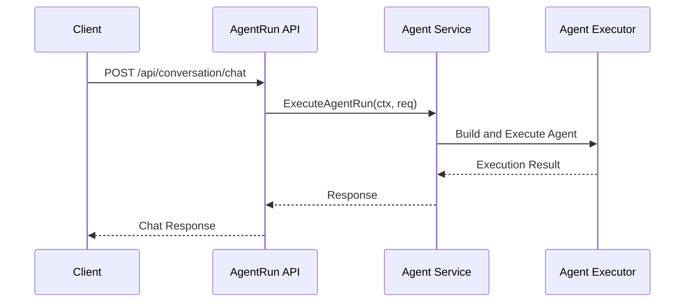
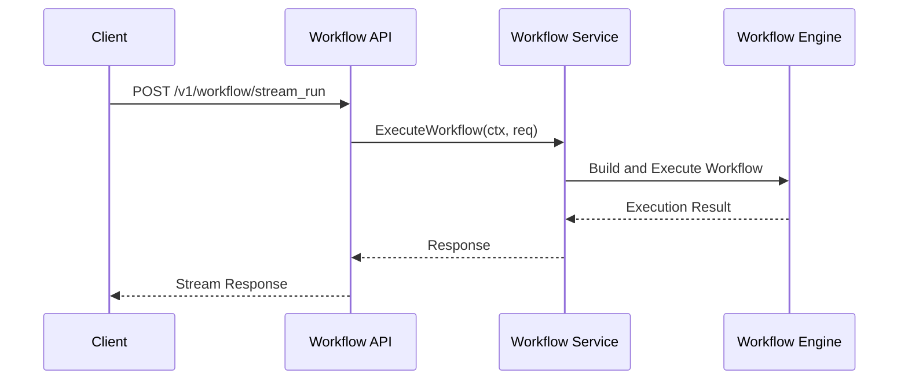
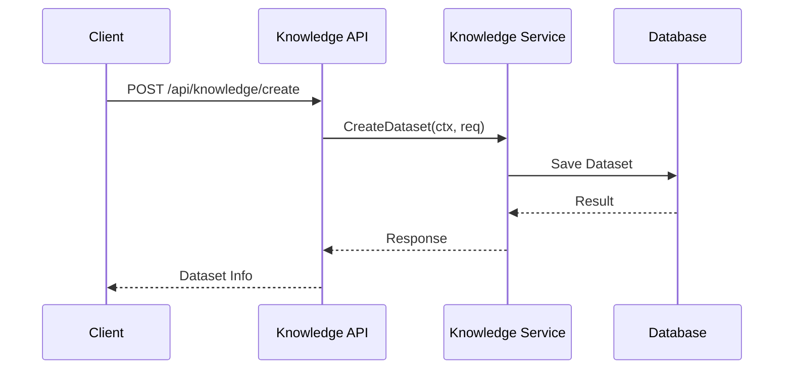

# Coze Studio 后端 API 文档

## 概述

本文档详细描述了 Coze Studio 后端提供的所有 REST API 接口。这些接口基于 Hertz Web 框架实现，遵循领域驱动设计（DDD）原则进行组织。

## 技术栈

- Web 框架：Hertz
- API 路由：基于 IDL 自动生成
- 语言：Golang

## API 分组

API 按功能分为多个组，包括 bot、conversation、knowledge、workflow、plugin 等。

## API 详情

### Bot 相关接口

| 方法 | 路径 | 处理函数 | 文件位置 |
|------|------|----------|----------|
| POST | /api/bot/get_type_list | GetTypeList | [backend/api/handler/coze/base.go](../../backend/api/handler/coze/base.go) |
| POST | /api/bot/upload_file | UploadFile | [backend/api/handler/coze/base.go](../../backend/api/handler/coze/base.go) |

### 通用接口

| 方法 | 路径 | 处理函数 | 文件位置 |
|------|------|----------|----------|
| GET | /api/common/upload/apply_upload_action | ApplyUploadAction | [backend/api/handler/coze/upload_service.go](../../backend/api/handler/coze/upload_service.go) |
| POST | /api/common/upload/apply_upload_action | ApplyUploadAction | [backend/api/handler/coze/upload_service.go](../../backend/api/handler/coze/upload_service.go) |
| POST | /api/common/upload/*tos_uri | CommonUpload | [backend/api/handler/coze/upload_service.go](../../backend/api/handler/coze/upload_service.go) |

### 对话接口

| 方法 | 路径 | 处理函数 | 文件位置 |
|------|------|----------|----------|
| POST | /api/conversation/break_message | BreakMessage | [backend/api/handler/coze/conversation_service.go](../../backend/api/handler/coze/conversation_service.go) |
| POST | /api/conversation/chat | AgentRun | [backend/api/handler/coze/agent_run_service.go](../../backend/api/handler/coze/agent_run_service.go) |
| POST | /api/conversation/clear_message | ClearConversationHistory | [backend/api/handler/coze/conversation_service.go](../../backend/api/handler/coze/conversation_service.go) |
| POST | /api/conversation/create_section | ClearConversationCtx | [backend/api/handler/coze/conversation_service.go](../../backend/api/handler/coze/conversation_service.go) |
| POST | /api/conversation/delete_message | DeleteMessage | [backend/api/handler/coze/conversation_service.go](../../backend/api/handler/coze/conversation_service.go) |
| POST | /api/conversation/get_message_list | GetMessageList | [backend/api/handler/coze/message_service.go](../../backend/api/handler/coze/message_service.go) |

### 开发者接口

| 方法 | 路径 | 处理函数 | 文件位置 |
|------|------|----------|----------|
| POST | /api/developer/get_icon | GetIcon | [backend/api/handler/coze/developer_api_service.go](../../backend/api/handler/coze/developer_api_service.go) |

### 草稿 Bot 接口

| 方法 | 路径 | 处理函数 | 文件位置 |
|------|------|----------|----------|
| POST | /api/draftbot/commit_check | CheckDraftBotCommit | [backend/api/handler/coze/base.go](../../backend/api/handler/coze/base.go) |
| POST | /api/draftbot/create | DraftBotCreate | [backend/api/handler/coze/base.go](../../backend/api/handler/coze/base.go) |
| POST | /api/draftbot/delete | DeleteDraftBot | [backend/api/handler/coze/base.go](../../backend/api/handler/coze/base.go) |
| POST | /api/draftbot/duplicate | DuplicateDraftBot | [backend/api/handler/coze/base.go](../../backend/api/handler/coze/base.go) |
| POST | /api/draftbot/get_display_info | GetDraftBotDisplayInfo | [backend/api/handler/coze/base.go](../../backend/api/handler/coze/base.go) |
| POST | /api/draftbot/list_draft_history | ListDraftBotHistory | [backend/api/handler/coze/base.go](../../backend/api/handler/coze/base.go) |
| POST | /api/draftbot/publish | PublishDraftBot | [backend/api/handler/coze/base.go](../../backend/api/handler/coze/base.go) |
| POST | /api/draftbot/update_display_info | UpdateDraftBotDisplayInfo | [backend/api/handler/coze/base.go](../../backend/api/handler/coze/base.go) |

#### 发布相关接口

| 方法 | 路径 | 处理函数 | 文件位置 |
|------|------|----------|----------|
| POST | /api/draftbot/publish/connector/list | PublishConnectorList | [backend/api/handler/coze/base.go](../../backend/api/handler/coze/base.go) |

### 智能体接口

#### 草稿项目接口

| 方法 | 路径 | 处理函数 | 文件位置 |
|------|------|----------|----------|
| POST | /api/intelligence_api/draft_project/copy | DraftProjectCopy | [backend/api/handler/coze/intelligence_service.go](../../backend/api/handler/coze/intelligence_service.go) |
| POST | /api/intelligence_api/draft_project/create | DraftProjectCreate | [backend/api/handler/coze/intelligence_service.go](../../backend/api/handler/coze/intelligence_service.go) |
| POST | /api/intelligence_api/draft_project/delete | DraftProjectDelete | [backend/api/handler/coze/intelligence_service.go](../../backend/api/handler/coze/intelligence_service.go) |
| POST | /api/intelligence_api/draft_project/inner_task_list | DraftProjectInnerTaskList | [backend/api/handler/coze/intelligence_service.go](../../backend/api/handler/coze/intelligence_service.go) |
| POST | /api/intelligence_api/draft_project/update | DraftProjectUpdate | [backend/api/handler/coze/intelligence_service.go](../../backend/api/handler/coze/intelligence_service.go) |

#### 发布相关接口

| 方法 | 路径 | 处理函数 | 文件位置 |
|------|------|----------|----------|
| POST | /api/intelligence_api/publish/check_version_number | CheckProjectVersionNumber | [backend/api/handler/coze/intelligence_service.go](../../backend/api/handler/coze/intelligence_service.go) |
| POST | /api/intelligence_api/publish/connector_list | ProjectPublishConnectorList | [backend/api/handler/coze/intelligence_service.go](../../backend/api/handler/coze/intelligence_service.go) |
| POST | /api/intelligence_api/publish/get_published_connector | GetProjectPublishedConnector | [backend/api/handler/coze/intelligence_service.go](../../backend/api/handler/coze/intelligence_service.go) |
| POST | /api/intelligence_api/publish/publish_project | PublishProject | [backend/api/handler/coze/intelligence_service.go](../../backend/api/handler/coze/intelligence_service.go) |
| POST | /api/intelligence_api/publish/publish_record_detail | GetPublishRecordDetail | [backend/api/handler/coze/intelligence_service.go](../../backend/api/handler/coze/intelligence_service.go) |
| POST | /api/intelligence_api/publish/publish_record_list | GetPublishRecordList | [backend/api/handler/coze/intelligence_service.go](../../backend/api/handler/coze/intelligence_service.go) |

#### 搜索相关接口

| 方法 | 路径 | 处理函数 | 文件位置 |
|------|------|----------|----------|
| POST | /api/intelligence_api/search/get_draft_intelligence_info | GetDraftIntelligenceInfo | [backend/api/handler/coze/intelligence_service.go](../../backend/api/handler/coze/intelligence_service.go) |
| POST | /api/intelligence_api/search/get_draft_intelligence_list | GetDraftIntelligenceList | [backend/api/handler/coze/intelligence_service.go](../../backend/api/handler/coze/intelligence_service.go) |
| POST | /api/intelligence_api/search/get_recently_edit_intelligence | GetUserRecentlyEditIntelligence | [backend/api/handler/coze/intelligence_service.go](../../backend/api/handler/coze/intelligence_service.go) |

### 知识库接口

| 方法 | 路径 | 处理函数 | 文件位置 |
|------|------|----------|----------|
| POST | /api/knowledge/create | CreateDataset | [backend/api/handler/coze/knowledge_service.go](../../backend/api/handler/coze/knowledge_service.go) |
| POST | /api/knowledge/delete | DeleteDataset | [backend/api/handler/coze/knowledge_service.go](../../backend/api/handler/coze/knowledge_service.go) |
| POST | /api/knowledge/detail | DatasetDetail | [backend/api/handler/coze/knowledge_service.go](../../backend/api/handler/coze/knowledge_service.go) |
| POST | /api/knowledge/list | ListDataset | [backend/api/handler/coze/knowledge_service.go](../../backend/api/handler/coze/knowledge_service.go) |
| POST | /api/knowledge/update | UpdateDataset | [backend/api/handler/coze/knowledge_service.go](../../backend/api/handler/coze/knowledge_service.go) |

#### 文档相关接口

| 方法 | 路径 | 处理函数 | 文件位置 |
|------|------|----------|----------|
| POST | /api/knowledge/document/create | CreateDocument | [backend/api/handler/coze/knowledge_service.go](../../backend/api/handler/coze/knowledge_service.go) |
| POST | /api/knowledge/document/delete | DeleteDocument | [backend/api/handler/coze/knowledge_service.go](../../backend/api/handler/coze/knowledge_service.go) |
| POST | /api/knowledge/document/list | ListDocument | [backend/api/handler/coze/knowledge_service.go](../../backend/api/handler/coze/knowledge_service.go) |
| POST | /api/knowledge/document/resegment | Resegment | [backend/api/handler/coze/knowledge_service.go](../../backend/api/handler/coze/knowledge_service.go) |
| POST | /api/knowledge/document/update | UpdateDocument | [backend/api/handler/coze/knowledge_service.go](../../backend/api/handler/coze/knowledge_service.go) |

#### 文档进度接口

| 方法 | 路径 | 处理函数 | 文件位置 |
|------|------|----------|----------|
| POST | /api/knowledge/document/progress/get | GetDocumentProgress | [backend/api/handler/coze/knowledge_service.go](../../backend/api/handler/coze/knowledge_service.go) |

#### 图标接口

| 方法 | 路径 | 处理函数 | 文件位置 |
|------|------|----------|----------|
| POST | /api/knowledge/icon/get | GetIconForDataset | [backend/api/handler/coze/knowledge_service.go](../../backend/api/handler/coze/knowledge_service.go) |

#### 照片接口

| 方法 | 路径 | 处理函数 | 文件位置 |
|------|------|----------|----------|
| POST | /api/knowledge/photo/caption | UpdatePhotoCaption | [backend/api/handler/coze/knowledge_service.go](../../backend/api/handler/coze/knowledge_service.go) |
| POST | /api/knowledge/photo/detail | PhotoDetail | [backend/api/handler/coze/knowledge_service.go](../../backend/api/handler/coze/knowledge_service.go) |
| POST | /api/knowledge/photo/extract_caption | ExtractPhotoCaption | [backend/api/handler/coze/knowledge_service.go](../../backend/api/handler/coze/knowledge_service.go) |
| POST | /api/knowledge/photo/list | ListPhoto | [backend/api/handler/coze/knowledge_service.go](../../backend/api/handler/coze/knowledge_service.go) |

#### 审核接口

| 方法 | 路径 | 处理函数 | 文件位置 |
|------|------|----------|----------|
| POST | /api/knowledge/review/create | CreateDocumentReview | [backend/api/handler/coze/knowledge_service.go](../../backend/api/handler/coze/knowledge_service.go) |
| POST | /api/knowledge/review/mget | MGetDocumentReview | [backend/api/handler/coze/knowledge_service.go](../../backend/api/handler/coze/knowledge_service.go) |
| POST | /api/knowledge/review/save | SaveDocumentReview | [backend/api/handler/coze/knowledge_service.go](../../backend/api/handler/coze/knowledge_service.go) |

#### 切片接口

| 方法 | 路径 | 处理函数 | 文件位置 |
|------|------|----------|----------|
| POST | /api/knowledge/slice/create | CreateSlice | [backend/api/handler/coze/knowledge_service.go](../../backend/api/handler/coze/knowledge_service.go) |
| POST | /api/knowledge/slice/delete | DeleteSlice | [backend/api/handler/coze/knowledge_service.go](../../backend/api/handler/coze/knowledge_service.go) |
| POST | /api/knowledge/slice/list | ListSlice | [backend/api/handler/coze/knowledge_service.go](../../backend/api/handler/coze/knowledge_service.go) |
| POST | /api/knowledge/slice/update | UpdateSlice | [backend/api/handler/coze/knowledge_service.go](../../backend/api/handler/coze/knowledge_service.go) |

#### 表结构接口

| 方法 | 路径 | 处理函数 | 文件位置 |
|------|------|----------|----------|
| POST | /api/knowledge/table_schema/get | GetTableSchema | [backend/api/handler/coze/knowledge_service.go](../../backend/api/handler/coze/knowledge_service.go) |
| POST | /api/knowledge/table_schema/validate | ValidateTableSchema | [backend/api/handler/coze/knowledge_service.go](../../backend/api/handler/coze/knowledge_service.go) |

### 市场接口

#### 产品接口

| 方法 | 路径 | 处理函数 | 文件位置 |
|------|------|----------|----------|
| GET | /api/marketplace/product/detail | PublicGetProductDetail | [backend/api/handler/coze/public_product_service.go](../../backend/api/handler/coze/public_product_service.go) |
| POST | /api/marketplace/product/duplicate | PublicDuplicateProduct | [backend/api/handler/coze/public_product_service.go](../../backend/api/handler/coze/public_product_service.go) |
| POST | /api/marketplace/product/favorite | PublicFavoriteProduct | [backend/api/handler/coze/public_product_service.go](../../backend/api/handler/coze/public_product_service.go) |

#### 收藏接口

| 方法 | 路径 | 处理函数 | 文件位置 |
|------|------|----------|----------|
| GET | /api/marketplace/product/favorite/list.v2 | PublicGetUserFavoriteListV2 | [backend/api/handler/coze/public_product_service.go](../../backend/api/handler/coze/public_product_service.go) |
| GET | /api/marketplace/product/list | PublicGetProductList | [backend/api/handler/coze/public_product_service.go](../../backend/api/handler/coze/public_product_service.go) |

### 记忆接口

| 方法 | 路径 | 处理函数 | 文件位置 |
|------|------|----------|----------|
| GET | /api/memory/doc_table_info | GetDocumentTableInfo | [backend/api/handler/coze/memory_service.go](../../backend/api/handler/coze/memory_service.go) |
| GET | /api/memory/sys_variable_conf | GetSysVariableConf | [backend/api/handler/coze/memory_service.go](../../backend/api/handler/coze/memory_service.go) |
| GET | /api/memory/table_mode_config | GetModeConfig | [backend/api/handler/coze/memory_service.go](../../backend/api/handler/coze/memory_service.go) |

#### 数据库接口

| 方法 | 路径 | 处理函数 | 文件位置 |
|------|------|----------|----------|
| POST | /api/memory/database/add | AddDatabase | [backend/api/handler/coze/database_service.go](../../backend/api/handler/coze/database_service.go) |
| POST | /api/memory/database/bind_to_bot | BindDatabase | [backend/api/handler/coze/database_service.go](../../backend/api/handler/coze/database_service.go) |
| POST | /api/memory/database/delete | DeleteDatabase | [backend/api/handler/coze/database_service.go](../../backend/api/handler/coze/database_service.go) |
| POST | /api/memory/database/get_by_id | GetDatabaseByID | [backend/api/handler/coze/database_service.go](../../backend/api/handler/coze/database_service.go) |
| POST | /api/memory/database/get_connector_name | GetConnectorName | [backend/api/handler/coze/database_service.go](../../backend/api/handler/coze/database_service.go) |
| POST | /api/memory/database/get_online_database_id | GetOnlineDatabaseId | [backend/api/handler/coze/database_service.go](../../backend/api/handler/coze/database_service.go) |
| POST | /api/memory/database/get_template | GetDatabaseTemplate | [backend/api/handler/coze/database_service.go](../../backend/api/handler/coze/database_service.go) |
| POST | /api/memory/database/list | ListDatabase | [backend/api/handler/coze/database_service.go](../../backend/api/handler/coze/database_service.go) |
| POST | /api/memory/database/list_records | ListDatabaseRecords | [backend/api/handler/coze/database_service.go](../../backend/api/handler/coze/database_service.go) |
| POST | /api/memory/database/unbind_to_bot | UnBindDatabase | [backend/api/handler/coze/database_service.go](../../backend/api/handler/coze/database_service.go) |
| POST | /api/memory/database/update | UpdateDatabase | [backend/api/handler/coze/database_service.go](../../backend/api/handler/coze/database_service.go) |
| POST | /api/memory/database/update_bot_switch | UpdateDatabaseBotSwitch | [backend/api/handler/coze/database_service.go](../../backend/api/handler/coze/database_service.go) |
| POST | /api/memory/database/update_records | UpdateDatabaseRecords | [backend/api/handler/coze/database_service.go](../../backend/api/handler/coze/database_service.go) |

#### 表接口

| 方法 | 路径 | 处理函数 | 文件位置 |
|------|------|----------|----------|
| POST | /api/memory/database/table/list_new | GetBotDatabase | [backend/api/handler/coze/database_service.go](../../backend/api/handler/coze/database_service.go) |
| POST | /api/memory/database/table/reset | ResetBotTable | [backend/api/handler/coze/database_service.go](../../backend/api/handler/coze/database_service.go) |

#### 项目变量接口

| 方法 | 路径 | 处理函数 | 文件位置 |
|------|------|----------|----------|
| GET | /api/memory/project/variable/meta_list | GetProjectVariableList | [backend/api/handler/coze/memory_service.go](../../backend/api/handler/coze/memory_service.go) |
| POST | /api/memory/project/variable/meta_update | UpdateProjectVariable | [backend/api/handler/coze/memory_service.go](../../backend/api/handler/coze/memory_service.go) |

#### 表文件接口

| 方法 | 路径 | 处理函数 | 文件位置 |
|------|------|----------|----------|
| POST | /api/memory/table_file/get_progress | DatabaseFileProgressData | [backend/api/handler/coze/memory_service.go](../../backend/api/handler/coze/memory_service.go) |
| POST | /api/memory/table_file/submit | SubmitDatabaseInsertTask | [backend/api/handler/coze/memory_service.go](../../backend/api/handler/coze/memory_service.go) |

#### 表结构接口

| 方法 | 路径 | 处理函数 | 文件位置 |
|------|------|----------|----------|
| POST | /api/memory/table_schema/get | GetDatabaseTableSchema | [backend/api/handler/coze/memory_service.go](../../backend/api/handler/coze/memory_service.go) |
| POST | /api/memory/table_schema/validate | ValidateDatabaseTableSchema | [backend/api/handler/coze/memory_service.go](../../backend/api/handler/coze/memory_service.go) |

#### 变量接口

| 方法 | 路径 | 处理函数 | 文件位置 |
|------|------|----------|----------|
| POST | /api/memory/variable/delete | DelProfileMemory | [backend/api/handler/coze/memory_service.go](../../backend/api/handler/coze/memory_service.go) |
| POST | /api/memory/variable/get | GetPlayGroundMemory | [backend/api/handler/coze/memory_service.go](../../backend/api/handler/coze/memory_service.go) |
| POST | /api/memory/variable/get_meta | GetMemoryVariableMeta | [backend/api/handler/coze/memory_service.go](../../backend/api/handler/coze/memory_service.go) |
| POST | /api/memory/variable/upsert | SetKvMemory | [backend/api/handler/coze/memory_service.go](../../backend/api/handler/coze/memory_service.go) |

### OAuth 接口

| 方法 | 路径 | 处理函数 | 文件位置 |
|------|------|----------|----------|
| GET | /api/oauth/authorization_code | OauthAuthorizationCode | [backend/api/handler/coze/base.go](../../backend/api/handler/coze/base.go) |

### 登录认证接口

#### 账户信息接口

| 方法 | 路径 | 处理函数 | 文件位置 |
|------|------|----------|----------|
| POST | /api/passport/account/info/v2/ | PassportAccountInfoV2 | [backend/api/handler/coze/passport_service.go](../../backend/api/handler/coze/passport_service.go) |

#### 邮箱登录接口

| 方法 | 路径 | 处理函数 | 文件位置 |
|------|------|----------|----------|
| POST | /api/passport/web/email/login/ | PassportWebEmailLoginPost | [backend/api/handler/coze/passport_service.go](../../backend/api/handler/coze/passport_service.go) |

#### 邮箱密码重置接口

| 方法 | 路径 | 处理函数 | 文件位置 |
|------|------|----------|----------|
| GET | /api/passport/web/email/password/reset/ | PassportWebEmailPasswordResetGet | [backend/api/handler/coze/passport_service.go](../../backend/api/handler/coze/passport_service.go) |

#### 邮箱注册接口

| 方法 | 路径 | 处理函数 | 文件位置 |
|------|------|----------|----------|
| POST | /api/passport/web/email/register/v2/ | PassportWebEmailRegisterV2Post | [backend/api/handler/coze/passport_service.go](../../backend/api/handler/coze/passport_service.go) |

#### 登出接口

| 方法 | 路径 | 处理函数 | 文件位置 |
|------|------|----------|----------|
| GET | /api/passport/web/logout/ | PassportWebLogoutGet | [backend/api/handler/coze/passport_service.go](../../backend/api/handler/coze/passport_service.go) |

### 权限接口

#### Coze Web 应用接口

| 方法 | 路径 | 处理函数 | 文件位置 |
|------|------|----------|----------|
| POST | /api/permission_api/coze_web_app/impersonate_coze_user | ImpersonateCozeUser | [backend/api/handler/coze/base.go](../../backend/api/handler/coze/base.go) |

#### 个人访问令牌接口

| 方法 | 路径 | 处理函数 | 文件位置 |
|------|------|----------|----------|
| POST | /api/permission_api/pat/create_personal_access_token_and_permission | CreatePersonalAccessTokenAndPermission | [backend/api/handler/coze/base.go](../../backend/api/handler/coze/base.go) |
| POST | /api/permission_api/pat/delete_personal_access_token_and_permission | DeletePersonalAccessTokenAndPermission | [backend/api/handler/coze/base.go](../../backend/api/handler/coze/base.go) |
| GET | /api/permission_api/pat/get_personal_access_token_and_permission | GetPersonalAccessTokenAndPermission | [backend/api/handler/coze/base.go](../../backend/api/handler/coze/base.go) |
| GET | /api/permission_api/pat/list_personal_access_tokens | ListPersonalAccessTokens | [backend/api/handler/coze/base.go](../../backend/api/handler/coze/base.go) |
| POST | /api/permission_api/pat/update_personal_access_token_and_permission | UpdatePersonalAccessTokenAndPermission | [backend/api/handler/coze/base.go](../../backend/api/handler/coze/base.go) |

### Playground 接口

| 方法 | 路径 | 处理函数 | 文件位置 |
|------|------|----------|----------|
| POST | /api/playground/get_onboarding | GetOnboarding | [backend/api/handler/coze/playground_service.go](../../backend/api/handler/coze/playground_service.go) |

#### 上传接口

| 方法 | 路径 | 处理函数 | 文件位置 |
|------|------|----------|----------|
| POST | /api/playground/upload/auth_token | GetUploadAuthToken | [backend/api/handler/coze/playground_service.go](../../backend/api/handler/coze/playground_service.go) |

### Playground API 接口

| 方法 | 路径 | 处理函数 | 文件位置 |
|------|------|----------|----------|
| POST | /api/playground_api/create_update_shortcut_command | CreateUpdateShortcutCommand | [backend/api/handler/coze/playground_service.go](../../backend/api/handler/coze/playground_service.go) |
| POST | /api/playground_api/delete_prompt_resource | DeletePromptResource | [backend/api/handler/coze/playground_service.go](../../backend/api/handler/coze/playground_service.go) |
| POST | /api/playground_api/get_file_list | GetFileUrls | [backend/api/handler/coze/playground_service.go](../../backend/api/handler/coze/playground_service.go) |
| POST | /api/playground_api/get_imagex_url | GetImagexShortUrl | [backend/api/handler/coze/playground_service.go](../../backend/api/handler/coze/playground_service.go) |
| POST | /api/playground_api/get_official_prompt_list | GetOfficialPromptResourceList | [backend/api/handler/coze/playground_service.go](../../backend/api/handler/coze/playground_service.go) |
| GET | /api/playground_api/get_prompt_resource_info | GetPromptResourceInfo | [backend/api/handler/coze/playground_service.go](../../backend/api/handler/coze/playground_service.go) |
| POST | /api/playground_api/mget_user_info | MGetUserBasicInfo | [backend/api/handler/coze/playground_service.go](../../backend/api/handler/coze/playground_service.go) |
| POST | /api/playground_api/report_user_behavior | ReportUserBehavior | [backend/api/handler/coze/playground_service.go](../../backend/api/handler/coze/playground_service.go) |
| POST | /api/playground_api/upsert_prompt_resource | UpsertPromptResource | [backend/api/handler/coze/playground_service.go](../../backend/api/handler/coze/playground_service.go) |

#### 草稿 Bot 接口

| 方法 | 路径 | 处理函数 | 文件位置 |
|------|------|----------|----------|
| POST | /api/playground_api/draftbot/get_draft_bot_info | GetDraftBotInfoAgw | [backend/api/handler/coze/base.go](../../backend/api/handler/coze/base.go) |
| POST | /api/playground_api/draftbot/update_draft_bot_info | UpdateDraftBotInfoAgw | [backend/api/handler/coze/base.go](../../backend/api/handler/coze/base.go) |

#### 操作接口

| 方法 | 路径 | 处理函数 | 文件位置 |
|------|------|----------|----------|
| POST | /api/playground_api/operate/get_bot_popup_info | GetBotPopupInfo | [backend/api/handler/coze/base.go](../../backend/api/handler/coze/base.go) |
| POST | /api/playground_api/operate/update_bot_popup_info | UpdateBotPopupInfo | [backend/api/handler/coze/base.go](../../backend/api/handler/coze/base.go) |

#### 空间接口

| 方法 | 路径 | 处理函数 | 文件位置 |
|------|------|----------|----------|
| POST | /api/playground_api/space/list | GetSpaceListV2 | [backend/api/handler/coze/base.go](../../backend/api/handler/coze/base.go) |

### 插件接口

| 方法 | 路径 | 处理函数 | 文件位置 |
|------|------|----------|----------|
| POST | /api/plugin/get_oauth_schema | GetOAuthSchema | [backend/api/handler/coze/base.go](../../backend/api/handler/coze/base.go) |

### 插件 API 接口

| 方法 | 路径 | 处理函数 | 文件位置 |
|------|------|----------|----------|
| POST | /api/plugin_api/batch_create_api | BatchCreateAPI | [backend/api/handler/coze/plugin_develop_service.go](../../backend/api/handler/coze/plugin_develop_service.go) |
| POST | /api/plugin_api/check_and_lock_plugin_edit | CheckAndLockPluginEdit | [backend/api/handler/coze/plugin_develop_service.go](../../backend/api/handler/coze/plugin_develop_service.go) |
| POST | /api/plugin_api/convert_to_openapi | Convert2OpenAPI | [backend/api/handler/coze/plugin_develop_service.go](../../backend/api/handler/coze/plugin_develop_service.go) |
| POST | /api/plugin_api/create_api | CreateAPI | [backend/api/handler/coze/plugin_develop_service.go](../../backend/api/handler/coze/plugin_develop_service.go) |
| POST | /api/plugin_api/debug_api | DebugAPI | [backend/api/handler/coze/plugin_develop_service.go](../../backend/api/handler/coze/plugin_develop_service.go) |
| POST | /api/plugin_api/del_plugin | DelPlugin | [backend/api/handler/coze/plugin_develop_service.go](../../backend/api/handler/coze/plugin_develop_service.go) |
| POST | /api/plugin_api/delete_api | DeleteAPI | [backend/api/handler/coze/plugin_develop_service.go](../../backend/api/handler/coze/plugin_develop_service.go) |
| POST | /api/plugin_api/get_bot_default_params | GetBotDefaultParams | [backend/api/handler/coze/plugin_develop_service.go](../../backend/api/handler/coze/plugin_develop_service.go) |
| POST | /api/plugin_api/get_dev_plugin_list | GetDevPluginList | [backend/api/handler/coze/plugin_develop_service.go](../../backend/api/handler/coze/plugin_develop_service.go) |
| POST | /api/plugin_api/get_oauth_schema | GetOAuthSchemaAPI | [backend/api/handler/coze/plugin_develop_service.go](../../backend/api/handler/coze/plugin_develop_service.go) |
| POST | /api/plugin_api/get_oauth_status | GetOAuthStatus | [backend/api/handler/coze/plugin_develop_service.go](../../backend/api/handler/coze/plugin_develop_service.go) |
| POST | /api/plugin_api/get_playground_plugin_list | GetPlaygroundPluginList | [backend/api/handler/coze/plugin_develop_service.go](../../backend/api/handler/coze/plugin_develop_service.go) |
| POST | /api/plugin_api/get_plugin_apis | GetPluginAPIs | [backend/api/handler/coze/plugin_develop_service.go](../../backend/api/handler/coze/plugin_develop_service.go) |
| POST | /api/plugin_api/get_plugin_info | GetPluginInfo | [backend/api/handler/coze/plugin_develop_service.go](../../backend/api/handler/coze/plugin_develop_service.go) |
| POST | /api/plugin_api/get_plugin_next_version | GetPluginNextVersion | [backend/api/handler/coze/plugin_develop_service.go](../../backend/api/handler/coze/plugin_develop_service.go) |
| POST | /api/plugin_api/get_queried_oauth_plugins | GetQueriedOAuthPluginList | [backend/api/handler/coze/plugin_develop_service.go](../../backend/api/handler/coze/plugin_develop_service.go) |
| POST | /api/plugin_api/get_updated_apis | GetUpdatedAPIs | [backend/api/handler/coze/plugin_develop_service.go](../../backend/api/handler/coze/plugin_develop_service.go) |
| POST | /api/plugin_api/get_user_authority | GetUserAuthority | [backend/api/handler/coze/plugin_develop_service.go](../../backend/api/handler/coze/plugin_develop_service.go) |
| POST | /api/plugin_api/library_resource_list | LibraryResourceList | [backend/api/handler/coze/plugin_develop_service.go](../../backend/api/handler/coze/plugin_develop_service.go) |
| POST | /api/plugin_api/project_resource_list | ProjectResourceList | [backend/api/handler/coze/plugin_develop_service.go](../../backend/api/handler/coze/plugin_develop_service.go) |
| POST | /api/plugin_api/publish_plugin | PublishPlugin | [backend/api/handler/coze/plugin_develop_service.go](../../backend/api/handler/coze/plugin_develop_service.go) |
| POST | /api/plugin_api/register | RegisterPlugin | [backend/api/handler/coze/plugin_develop_service.go](../../backend/api/handler/coze/plugin_develop_service.go) |
| POST | /api/plugin_api/register_plugin_meta | RegisterPluginMeta | [backend/api/handler/coze/plugin_develop_service.go](../../backend/api/handler/coze/plugin_develop_service.go) |
| POST | /api/plugin_api/resource_copy_cancel | ResourceCopyCancel | [backend/api/handler/coze/plugin_develop_service.go](../../backend/api/handler/coze/plugin_develop_service.go) |
| POST | /api/plugin_api/resource_copy_detail | ResourceCopyDetail | [backend/api/handler/coze/plugin_develop_service.go](../../backend/api/handler/coze/plugin_develop_service.go) |
| POST | /api/plugin_api/resource_copy_dispatch | ResourceCopyDispatch | [backend/api/handler/coze/plugin_develop_service.go](../../backend/api/handler/coze/plugin_develop_service.go) |
| POST | /api/plugin_api/resource_copy_retry | ResourceCopyRetry | [backend/api/handler/coze/plugin_develop_service.go](../../backend/api/handler/coze/plugin_develop_service.go) |
| POST | /api/plugin_api/revoke_auth_token | RevokeAuthToken | [backend/api/handler/coze/plugin_develop_service.go](../../backend/api/handler/coze/plugin_develop_service.go) |
| POST | /api/plugin_api/unlock_plugin_edit | UnlockPluginEdit | [backend/api/handler/coze/plugin_develop_service.go](../../backend/api/handler/coze/plugin_develop_service.go) |
| POST | /api/plugin_api/update | UpdatePlugin | [backend/api/handler/coze/plugin_develop_service.go](../../backend/api/handler/coze/plugin_develop_service.go) |
| POST | /api/plugin_api/update_api | UpdateAPI | [backend/api/handler/coze/plugin_develop_service.go](../../backend/api/handler/coze/plugin_develop_service.go) |
| POST | /api/plugin_api/update_bot_default_params | UpdateBotDefaultParams | [backend/api/handler/coze/plugin_develop_service.go](../../backend/api/handler/coze/plugin_develop_service.go) |
| POST | /api/plugin_api/update_plugin_meta | UpdatePluginMeta | [backend/api/handler/coze/plugin_develop_service.go](../../backend/api/handler/coze/plugin_develop_service.go) |

### 用户接口

| 方法 | 路径 | 处理函数 | 文件位置 |
|------|------|----------|----------|
| POST | /api/user/update_profile | UserUpdateProfile | [backend/api/handler/coze/base.go](../../backend/api/handler/coze/base.go) |
| POST | /api/user/update_profile_check | UpdateUserProfileCheck | [backend/api/handler/coze/base.go](../../backend/api/handler/coze/base.go) |

### Web 用户接口

#### 更新用户接口

| 方法 | 路径 | 处理函数 | 文件位置 |
|------|------|----------|----------|
| POST | /api/web/user/update/upload_avatar/ | UserUpdateAvatar | [backend/api/handler/coze/base.go](../../backend/api/handler/coze/base.go) |

### 工作流接口

| 方法 | 路径 | 处理函数 | 文件位置 |
|------|------|----------|----------|
| GET | /api/workflow_api/apiDetail | GetApiDetail | [backend/api/handler/coze/workflow_service.go](../../backend/api/handler/coze/workflow_service.go) |
| POST | /api/workflow_api/batch_delete | BatchDeleteWorkflow | [backend/api/handler/coze/workflow_service.go](../../backend/api/handler/coze/workflow_service.go) |
| POST | /api/workflow_api/cancel | CancelWorkFlow | [backend/api/handler/coze/workflow_service.go](../../backend/api/handler/coze/workflow_service.go) |
| POST | /api/workflow_api/canvas | GetCanvasInfo | [backend/api/handler/coze/workflow_service.go](../../backend/api/handler/coze/workflow_service.go) |
| POST | /api/workflow_api/copy | CopyWorkflow | [backend/api/handler/coze/workflow_service.go](../../backend/api/handler/coze/workflow_service.go) |
| POST | /api/workflow_api/copy_wk_template | CopyWkTemplateApi | [backend/api/handler/coze/workflow_service.go](../../backend/api/handler/coze/workflow_service.go) |
| POST | /api/workflow_api/create | CreateWorkflow | [backend/api/handler/coze/workflow_service.go](../../backend/api/handler/coze/workflow_service.go) |
| POST | /api/workflow_api/delete | DeleteWorkflow | [backend/api/handler/coze/workflow_service.go](../../backend/api/handler/coze/workflow_service.go) |
| POST | /api/workflow_api/delete_strategy | GetDeleteStrategy | [backend/api/handler/coze/workflow_service.go](../../backend/api/handler/coze/workflow_service.go) |
| POST | /api/workflow_api/example_workflow_list | GetExampleWorkFlowList | [backend/api/handler/coze/workflow_service.go](../../backend/api/handler/coze/workflow_service.go) |
| GET | /api/workflow_api/get_node_execute_history | GetNodeExecuteHistory | [backend/api/handler/coze/workflow_service.go](../../backend/api/handler/coze/workflow_service.go) |
| GET | /api/workflow_api/get_process | GetWorkFlowProcess | [backend/api/handler/coze/workflow_service.go](../../backend/api/handler/coze/workflow_service.go) |
| POST | /api/workflow_api/get_trace | GetTraceSDK | [backend/api/handler/coze/workflow_service.go](../../backend/api/handler/coze/workflow_service.go) |
| POST | /api/workflow_api/history_schema | GetHistorySchema | [backend/api/handler/coze/workflow_service.go](../../backend/api/handler/coze/workflow_service.go) |
| POST | /api/workflow_api/list_publish_workflow | ListPublishWorkflow | [backend/api/handler/coze/workflow_service.go](../../backend/api/handler/coze/workflow_service.go) |
| POST | /api/workflow_api/list_spans | ListRootSpans | [backend/api/handler/coze/workflow_service.go](../../backend/api/handler/coze/workflow_service.go) |
| POST | /api/workflow_api/llm_fc_setting_detail | GetLLMNodeFCSettingDetail | [backend/api/handler/coze/workflow_service.go](../../backend/api/handler/coze/workflow_service.go) |
| POST | /api/workflow_api/llm_fc_setting_merged | GetLLMNodeFCSettingsMerged | [backend/api/handler/coze/workflow_service.go](../../backend/api/handler/coze/workflow_service.go) |
| POST | /api/workflow_api/nodeDebug | WorkflowNodeDebugV2 | [backend/api/handler/coze/workflow_service.go](../../backend/api/handler/coze/workflow_service.go) |
| POST | /api/workflow_api/node_panel_search | NodePanelSearch | [backend/api/handler/coze/workflow_service.go](../../backend/api/handler/coze/workflow_service.go) |
| POST | /api/workflow_api/node_template_list | NodeTemplateList | [backend/api/handler/coze/workflow_service.go](../../backend/api/handler/coze/workflow_service.go) |
| POST | /api/workflow_api/node_type | QueryWorkflowNodeTypes | [backend/api/handler/coze/workflow_service.go](../../backend/api/handler/coze/workflow_service.go) |
| POST | /api/workflow_api/publish | PublishWorkflow | [backend/api/handler/coze/workflow_service.go](../../backend/api/handler/coze/workflow_service.go) |
| POST | /api/workflow_api/released_workflows | GetReleasedWorkflows | [backend/api/handler/coze/workflow_service.go](../../backend/api/handler/coze/workflow_service.go) |
| POST | /api/workflow_api/save | SaveWorkflow | [backend/api/handler/coze/workflow_service.go](../../backend/api/handler/coze/workflow_service.go) |
| POST | /api/workflow_api/sign_image_url | SignImageURL | [backend/api/handler/coze/workflow_service.go](../../backend/api/handler/coze/workflow_service.go) |
| POST | /api/workflow_api/test_resume | WorkflowTestResume | [backend/api/handler/coze/workflow_service.go](../../backend/api/handler/coze/workflow_service.go) |
| POST | /api/workflow_api/test_run | WorkflowTestRun | [backend/api/handler/coze/workflow_service.go](../../backend/api/handler/coze/workflow_service.go) |
| POST | /api/workflow_api/update_meta | UpdateWorkflowMeta | [backend/api/handler/coze/workflow_service.go](../../backend/api/handler/coze/workflow_service.go) |
| POST | /api/workflow_api/validate_tree | ValidateTree | [backend/api/handler/coze/workflow_service.go](../../backend/api/handler/coze/workflow_service.go) |
| POST | /api/workflow_api/workflow_detail | GetWorkflowDetail | [backend/api/handler/coze/workflow_service.go](../../backend/api/handler/coze/workflow_service.go) |
| POST | /api/workflow_api/workflow_detail_info | GetWorkflowDetailInfo | [backend/api/handler/coze/workflow_service.go](../../backend/api/handler/coze/workflow_service.go) |
| POST | /api/workflow_api/workflow_list | GetWorkFlowList | [backend/api/handler/coze/workflow_service.go](../../backend/api/handler/coze/workflow_service.go) |
| POST | /api/workflow_api/workflow_references | GetWorkflowReferences | [backend/api/handler/coze/workflow_service.go](../../backend/api/handler/coze/workflow_service.go) |

#### 对话流角色接口

| 方法 | 路径 | 处理函数 | 文件位置 |
|------|------|----------|----------|
| POST | /api/workflow_api/chat_flow_role/create | CreateChatFlowRole | [backend/api/handler/coze/workflow_service.go](../../backend/api/handler/coze/workflow_service.go) |
| POST | /api/workflow_api/chat_flow_role/delete | DeleteChatFlowRole | [backend/api/handler/coze/workflow_service.go](../../backend/api/handler/coze/workflow_service.go) |
| GET | /api/workflow_api/chat_flow_role/get | GetChatFlowRole | [backend/api/handler/coze/workflow_service.go](../../backend/api/handler/coze/workflow_service.go) |

#### 项目对话接口

| 方法 | 路径 | 处理函数 | 文件位置 |
|------|------|----------|----------|
| POST | /api/workflow_api/project_conversation/create | CreateProjectConversationDef | [backend/api/handler/coze/workflow_service.go](../../backend/api/handler/coze/workflow_service.go) |
| POST | /api/workflow_api/project_conversation/delete | DeleteProjectConversationDef | [backend/api/handler/coze/workflow_service.go](../../backend/api/handler/coze/workflow_service.go) |
| GET | /api/workflow_api/project_conversation/list | ListProjectConversationDef | [backend/api/handler/coze/workflow_service.go](../../backend/api/handler/coze/workflow_service.go) |
| POST | /api/workflow_api/project_conversation/update | UpdateProjectConversationDef | [backend/api/handler/coze/workflow_service.go](../../backend/api/handler/coze/workflow_service.go) |

#### 上传接口

| 方法 | 路径 | 处理函数 | 文件位置 |
|------|------|----------|----------|
| POST | /api/workflow_api/upload/auth_token | GetWorkflowUploadAuthToken | [backend/api/handler/coze/workflow_service.go](../../backend/api/handler/coze/workflow_service.go) |

### V1 版本接口

| 方法 | 路径 | 处理函数 | 文件位置 |
|------|------|----------|----------|
| GET | /v1/conversations | ListConversationsApi | [backend/api/handler/coze/conversation_service.go](../../backend/api/handler/coze/conversation_service.go) |
| DELETE | /v1/conversations/:conversation_id | DeleteConversationApi | [backend/api/handler/coze/conversation_service.go](../../backend/api/handler/coze/conversation_service.go) |
| PUT | /v1/conversations/:conversation_id | UpdateConversationApi | [backend/api/handler/coze/conversation_service.go](../../backend/api/handler/coze/conversation_service.go) |

#### 应用接口

| 方法 | 路径 | 处理函数 | 文件位置 |
|------|------|----------|----------|
| GET | /v1/apps/:app_id | GetOnlineAppData | [backend/api/handler/coze/bot_open_api_service.go](../../backend/api/handler/coze/bot_open_api_service.go) |

#### Bot 接口

| 方法 | 路径 | 处理函数 | 文件位置 |
|------|------|----------|----------|
| GET | /v1/bot/get_online_info | GetBotOnlineInfo | [backend/api/handler/coze/bot_open_api_service.go](../../backend/api/handler/coze/bot_open_api_service.go) |

#### Bots 接口

| 方法 | 路径 | 处理函数 | 文件位置 |
|------|------|----------|----------|
| GET | /v1/bots/:bot_id | OpenGetBotInfo | [backend/api/handler/coze/bot_open_api_service.go](../../backend/api/handler/coze/bot_open_api_service.go) |

#### 对话接口

| 方法 | 路径 | 处理函数 | 文件位置 |
|------|------|----------|----------|
| POST | /v1/conversation/create | CreateConversation | [backend/api/handler/coze/conversation_service.go](../../backend/api/handler/coze/conversation_service.go) |

#### 消息接口

| 方法 | 路径 | 处理函数 | 文件位置 |
|------|------|----------|----------|
| POST | /v1/conversation/message/list | GetApiMessageList | [backend/api/handler/coze/message_service.go](../../backend/api/handler/coze/message_service.go) |

#### 对话清除接口

| 方法 | 路径 | 处理函数 | 文件位置 |
|------|------|----------|----------|
| POST | /v1/conversations/:conversation_id/clear | ClearConversationApi | [backend/api/handler/coze/conversation_service.go](../../backend/api/handler/coze/conversation_service.go) |

#### 文件接口

| 方法 | 路径 | 处理函数 | 文件位置 |
|------|------|----------|----------|
| POST | /v1/files/upload | UploadFileOpen | [backend/api/handler/coze/upload_service.go](../../backend/api/handler/coze/upload_service.go) |

#### 工作流接口

| 方法 | 路径 | 处理函数 | 文件位置 |
|------|------|----------|----------|
| GET | /v1/workflow/get_run_history | OpenAPIGetWorkflowRunHistory | [backend/api/handler/coze/workflow_service.go](../../backend/api/handler/coze/workflow_service.go) |
| POST | /v1/workflow/run | OpenAPIRunFlow | [backend/api/handler/coze/workflow_service.go](../../backend/api/handler/coze/workflow_service.go) |
| POST | /v1/workflow/stream_resume | OpenAPIStreamResumeFlow | [backend/api/handler/coze/workflow_service.go](../../backend/api/handler/coze/workflow_service.go) |
| POST | /v1/workflow/stream_run | OpenAPIStreamRunFlow | [backend/api/handler/coze/workflow_service.go](../../backend/api/handler/coze/workflow_service.go) |

#### 对话接口

| 方法 | 路径 | 处理函数 | 文件位置 |
|------|------|----------|----------|
| POST | /v1/workflow/conversation/create | OpenAPICreateConversation | [backend/api/handler/coze/conversation_service.go](../../backend/api/handler/coze/conversation_service.go) |

#### 工作流集合接口

| 方法 | 路径 | 处理函数 | 文件位置 |
|------|------|----------|----------|
| POST | /v1/workflows/chat | OpenAPIChatFlowRun | [backend/api/handler/coze/workflow_service.go](../../backend/api/handler/coze/workflow_service.go) |
| GET | /v1/workflows/:workflow_id | OpenAPIGetWorkflowInfo | [backend/api/handler/coze/workflow_service.go](../../backend/api/handler/coze/workflow_service.go) |

### V3 版本接口

| 方法 | 路径 | 处理函数 | 文件位置 |
|------|------|----------|----------|
| POST | /v3/chat | ChatV3 | [backend/api/handler/coze/agent_run_service.go](../../backend/api/handler/coze/agent_run_service.go) |

#### 聊天接口

| 方法 | 路径 | 处理函数 | 文件位置 |
|------|------|----------|----------|
| POST | /v3/chat/cancel | CancelChatApi | [backend/api/handler/coze/agent_run_service.go](../../backend/api/handler/coze/agent_run_service.go) |

## 类图

```mermaid
classDiagram
    class APIRouter {
        +Register(r *server.Hertz)
    }

    class BotAPI {
        +GetTypeList(ctx context.Context, c *app.RequestContext)
        +UploadFile(ctx context.Context, c *app.RequestContext)
    }

    class ConversationAPI {
        +BreakMessage(ctx context.Context, c *app.RequestContext)
        +AgentRun(ctx context.Context, c *app.RequestContext)
        +ClearConversationHistory(ctx context.Context, c *app.RequestContext)
        +ClearConversationCtx(ctx context.Context, c *app.RequestContext)
        +DeleteMessage(ctx context.Context, c *app.RequestContext)
        +GetMessageList(ctx context.Context, c *app.RequestContext)
    }

    class KnowledgeAPI {
        +CreateDataset(ctx context.Context, c *app.RequestContext)
        +DeleteDataset(ctx context.Context, c *app.RequestContext)
        +DatasetDetail(ctx context.Context, c *app.RequestContext)
        +ListDataset(ctx context.Context, c *app.RequestContext)
        +UpdateDataset(ctx context.Context, c *app.RequestContext)
    }

    class WorkflowAPI {
        +GetApiDetail(ctx context.Context, c *app.RequestContext)
        +BatchDeleteWorkflow(ctx context.Context, c *app.RequestContext)
        +CancelWorkFlow(ctx context.Context, c *app.RequestContext)
        +GetCanvasInfo(ctx context.Context, c *app.RequestContext)
        +CopyWorkflow(ctx context.Context, c *app.RequestContext)
        +CreateWorkflow(ctx context.Context, c *app.RequestContext)
        +DeleteWorkflow(ctx context.Context, c *app.RequestContext)
        +GetWorkFlowList(ctx context.Context, c *app.RequestContext)
    }

    class PluginAPI {
        +BatchCreateAPI(ctx context.Context, c *app.RequestContext)
        +DebugAPI(ctx context.Context, c *app.RequestContext)
        +DelPlugin(ctx context.Context, c *app.RequestContext)
        +GetDevPluginList(ctx context.Context, c *app.RequestContext)
        +GetPluginAPIs(ctx context.Context, c *app.RequestContext)
    }

    APIRouter --> BotAPI
    APIRouter --> ConversationAPI
    APIRouter --> KnowledgeAPI
    APIRouter --> WorkflowAPI
    APIRouter --> PluginAPI
```

## 核心 API 时序图

### 对话 API 时序图

### 工作流运行 API 时序图

### 知识库创建 API 时序图

## 数据流

API 层接收客户端请求，将请求参数解析后传递给应用层服务进行处理。应用层服务协调领域层对象完成业务逻辑，然后通过基础设施层访问数据库或其他外部服务。处理结果逐层返回，最终由 API 层封装成 HTTP 响应返回给客户端。

## 总结

Coze Studio 后端提供了丰富的 API 接口，涵盖了 Bot 管理、对话处理、知识库管理、工作流设计、插件开发等核心功能。这些接口按照业务功能进行了合理分组，便于开发者使用和维护。
