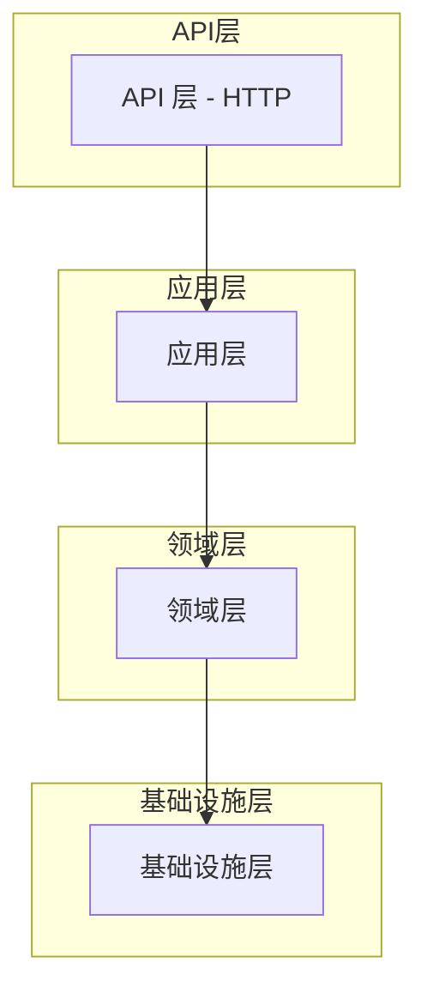
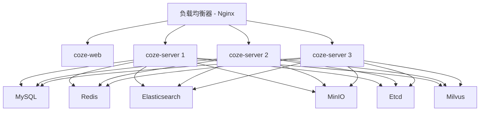

# Coze Studio 系统架构

## 1. 概述

Coze Studio 是一个一体化的 AI Agent 开发工具，源自服务数万家企业和数百万开发者的「Coze 开发平台」。其核心引擎已完全开源，提供了一站式可视化 AI Agent 开发工具，使创建、调试和部署 AI Agent 变得简单。

Coze Studio 后端采用 Golang 开发，前端使用 React + TypeScript，整体架构基于微服务并遵循领域驱动设计（DDD）原则构建。它为开发人员提供了一个高性能、高可扩展性且易于定制的底层框架，帮助他们应对复杂的业务需求。

## 2. 系统架构

Coze Studio 遵循微服务架构，前后端组件之间有明确的分离。该系统采用分层架构模式设计，包括：

1. 表现层（API）
2. 应用层
3. 领域层
4. 基础设施层

### 2.1 高层架构

```mermaid
graph TB
    A[前端 (React)] --> B(API 网关 - Nginx)
    B --> C[后端 (Go/Hertz)]
    C --> D[应用服务]
    C --> E[领域服务]
    C --> F[基础设施层]
    F --> G[数据库 (MySQL)]
    F --> H[消息队列 (NSQ)]
    F --> I[存储 (MinIO)]
```

### 2.2 组件架构

系统由以下主要组件组成：

#### 2.2.1 核心服务

1. **coze-server**：使用 Go 和 Hertz 框架构建的主后端服务
2. **coze-web**：使用 React 构建的前端 Web 应用
3. **nginx**：反向代理和负载均衡器

#### 2.2.2 基础设施服务

1. **MySQL**：用于存储应用数据的主数据库
2. **Redis**：缓存层，提升性能
3. **Elasticsearch**：用于知识库索引和检索的搜索引擎
4. **MinIO**：用于文件和资产的对象存储
5. **Etcd**：用于配置的分布式键值存储
6. **Milvus**：用于相似性搜索的向量数据库
7. **NSQ**：用于异步处理的消息队列

## 3. 后端架构

后端遵循领域驱动设计（DDD）方法，在不同层之间有明确的关注点分离。

### 3.1 分层架构



### 3.2 后端目录结构

后端代码按以下关键目录组织：

- [api/](../../backend/api)：HTTP 接口层，包含处理程序、中间件和路由
- [application/](../../backend/application)：应用服务层，协调领域对象
- [domain/](../../backend/domain)：领域模型和业务逻辑
- [infra/](../../backend/infra)：基础设施实现（数据库、消息队列、第三方服务适配器）
- [conf/](../../backend/conf)：配置文件（模型、插件等 YAML 格式）
- [types/](../../backend/types)：常量和错误代码定义

### 3.3 领域模块

系统根据业务功能分为多个领域模块：

1. **Agent**：AI Agent 管理和执行
2. **Workflow**：工作流创建、修改、发布和执行
3. **Plugin**：插件开发和管理
4. **Knowledge**：知识库管理和检索
5. **Memory**：对话和上下文的内存管理
6. **User**：用户管理和认证
7. **App**：应用创建和管理
8. **Conversation**：对话处理和消息管理
9. **Prompt**：提示词管理和优化
10. **Search**：跨资源搜索功能
11. **Upload**：文件上传和管理
12. **Model Manager**：模型集成和管理
13. **Template**：快速开始的模板管理
14. **Connector**：与外部服务的集成
15. **Shortcut Command**：快捷命令功能

### 3.4 跨域集成

系统使用跨域契约确保不同模块之间的松耦合。这些契约在 [crossdomain/](../../backend/crossdomain) 目录中定义，并在 [crossdomain/impl/](../../backend/crossdomain/impl) 中实现。

## 4. 前端架构

前端使用 React 和 TypeScript 构建，遵循基于组件的架构。

### 4.1 关键包

- [apps/coze-studio](../../frontend/apps/coze-studio)：主应用程序入口点
- [packages/](../../frontend/packages)：可复用组件包
  - [workflow](../../frontend/packages/workflow)：工作流编辑和管理组件
  - [agent-ide](../../frontend/packages/agent-ide)：Agent 开发环境
  - [project-ide](../../frontend/packages/project-ide)：项目管理界面
  - [components](../../frontend/packages/components)：共享 UI 组件
  - [studio](../../frontend/packages/studio)：核心 studio 组件
  - [arch](../../frontend/packages/arch)：架构相关工具
  - [common](../../frontend/packages/common)：通用工具和帮助程序
  - [data](../../frontend/packages/data)：数据管理和状态处理
  - [devops](../../frontend/packages/devops)：DevOps 相关组件
  - [foundation](../../frontend/packages/foundation)：基础组件和样式
  - [community](../../frontend/packages/community)：社区相关功能

### 4.2 构建系统

前端使用 Rsbuild/Rspack 进行构建和打包，配置文件在 [config/](../../frontend/config) 目录中。

## 5. 数据流

Coze Studio 中的典型数据流遵循以下模式：

1. 用户与前端 UI 交互
2. 前端向后端 API 发起 HTTP 请求
3. API 层将请求路由到适当的处理程序
4. 处理程序调用应用服务
5. 应用服务协调领域对象和基础设施
6. 执行领域逻辑
7. 通过基础设施层持久化结果
8. 响应通过 API 层返回到前端
9. 前端更新 UI

对于异步操作：
1. 后端将事件发布到消息队列（NSQ）
2. 工作者消费事件并处理它们
3. 结果存储在数据库或其他存储系统中

## 6. 部署架构

Coze Studio 专为使用 Docker 和 Docker Compose 的容器化部署而设计。

### 6.1 容器架构



### 6.2 部署选项

1. **开发部署**：使用 [docker-compose-debug.yml](../../docker/docker-compose-debug.yml) 进行本地开发
2. **生产部署**：使用 [docker-compose.yml](../../docker/docker-compose.yml) 进行标准部署
3. **Kubernetes 部署**：使用 [helm/charts/opencoze/](../../helm/charts/opencoze) 中的 Helm 图表

### 6.3 服务依赖

- coze-server 依赖 MySQL、Redis、Elasticsearch、MinIO、Etcd 和 Milvus
- coze-web 依赖 coze-server
- 所有基础设施服务都独立启动，并且是应用程序正常运行所必需的

## 7. 技术栈

### 7.1 后端

- **语言**：Go (≥1.23.4)
- **框架**：Hertz (CloudWeGo)
- **RPC**：Thrift 用于服务通信
- **数据库**：MySQL 或 OceanBase
- **缓存**：Redis
- **消息队列**：NSQ
- **搜索**：Elasticsearch
- **存储**：MinIO
- **配置**：Etcd
- **向量数据库**：Milvus

### 7.2 前端

- **框架**：React 和 TypeScript
- **构建工具**：Rsbuild/Rspack
- **状态管理**：未明确提及
- **UI 组件**：自定义组件库
- **样式**：可能使用 Tailwind CSS

### 7.3 基础设施

- **容器化**：Docker
- **编排**：Docker Compose、Kubernetes (Helm)
- **代理**：Nginx
- **数据库迁移**：Atlas

## 8. 安全考虑

在公共网络环境中部署 Coze Studio 时，应考虑以下几种安全风险：

1. 账户注册功能
2. 工作流代码节点中的 Python 执行环境
3. 服务器监听地址配置
4. 服务器端请求伪造 (SSRF)
5. API 中的水平权限提升

建议在公共网络环境中部署之前评估这些风险并实施适当的保护措施。