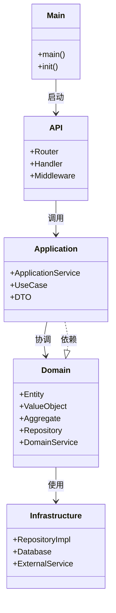
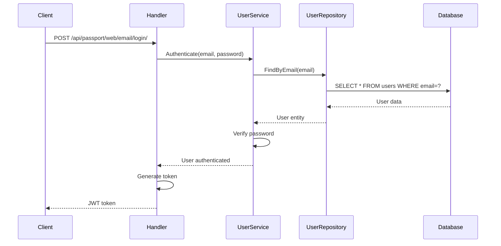
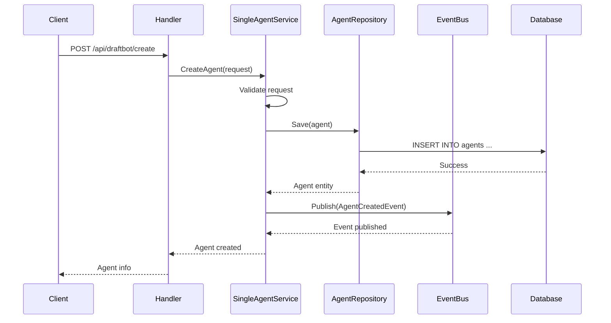
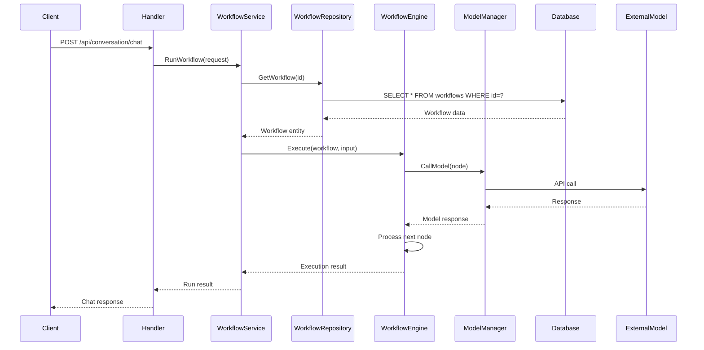
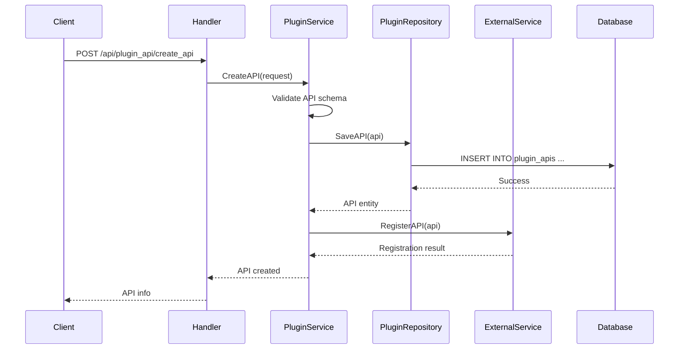
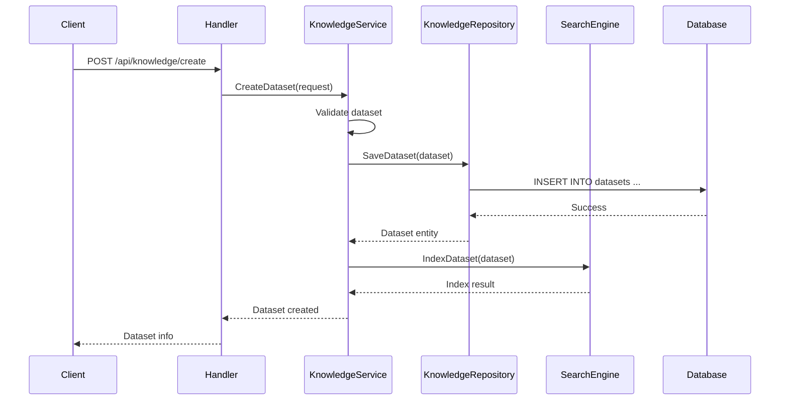

# Coze Studio 后端架构

## 1. 概述

Coze Studio 后端采用微服务架构，基于 Golang 实现，遵循领域驱动设计（DDD）原则。后端使用 Hertz（CloudWeGo）作为高性能 Web 框架，通过 Thrift 定义跨服务接口协议（IDL），保证服务间通信一致性。

## 2. 技术栈

- **语言**: Go (≥1.23.4)
- **Web 框架**: Hertz (CloudWeGo)
- **RPC**: Thrift
- **数据库**: MySQL 或 OceanBase
- **缓存**: Redis
- **消息队列**: NSQ
- **搜索引擎**: Elasticsearch
- **对象存储**: MinIO
- **配置管理**: Etcd
- **向量数据库**: Milvus

## 3. 项目结构

```
backend/
├── api/                    # API 层
│   ├── handler/            # 请求处理器
│   ├── middleware/         # 中间件
│   ├── model/              # 数据模型
│   └── router/             # 路由配置
├── application/            # 应用层
│   ├── app/                # 应用模块
│   ├── connector/          # 连接器模块
│   ├── conversation/       # 对话模块
│   ├── knowledge/          # 知识库模块
│   ├── memory/             # 内存模块
│   ├── plugin/             # 插件模块
│   ├── singleagent/        # 单 Agent 模块
│   ├── workflow/           # 工作流模块
│   └── ...                 # 其他应用模块
├── domain/                 # 领域层
│   ├── agent/              # Agent 领域
│   ├── app/                # 应用领域
│   ├── conversation/       # 对话领域
│   ├── knowledge/          # 知识库领域
│   ├── memory/             # 内存领域
│   ├── plugin/             # 插件领域
│   ├── workflow/           # 工作流领域
│   └── ...                 # 其他领域模块
├── infra/                  # 基础设施层
│   ├── contract/           # 契约接口
│   └── impl/               # 实现
├── pkg/                    # 公共包
├── types/                  # 类型定义
└── main.go                 # 程序入口
```

## 4. 架构分层

Coze Studio 后端采用经典的分层架构模式：

### 4.1 API 层

API 层负责处理 HTTP 请求和响应，包括路由配置、请求验证、中间件处理等。

主要目录：
- [api/handler/](../../backend/api/handler) - 请求处理器
- [api/router/](../../backend/api/router) - 路由配置
- [api/middleware/](../../backend/api/middleware) - 中间件
- [api/model/](../../backend/api/model) - 数据模型

### 4.2 应用层

应用层负责协调领域对象，实现业务用例，处理事务边界。

主要目录：
- [application/](../../backend/application) - 应用服务
- [application/app/](../../backend/application/app) - 应用模块
- [application/workflow/](../../backend/application/workflow) - 工作流应用服务
- [application/plugin/](../../backend/application/plugin) - 插件应用服务
- [application/knowledge/](../../backend/application/knowledge) - 知识库应用服务

### 4.3 领域层

领域层包含核心业务逻辑和领域模型，是业务规则的实现。

主要目录：
- [domain/](../../backend/domain) - 领域模型
- [domain/workflow/](../../backend/domain/workflow) - 工作流领域
- [domain/plugin/](../../backend/domain/plugin) - 插件领域
- [domain/agent/](../../backend/domain/agent) - Agent 领域
- [domain/knowledge/](../../backend/domain/knowledge) - 知识库领域

### 4.4 基础设施层

基础设施层提供技术实现，包括数据库访问、外部服务调用等。

主要目录：
- [infra/](../../backend/infra) - 基础设施
- [infra/impl/](../../backend/infra/impl) - 实现
- [infra/contract/](../../backend/infra/contract) - 契约接口

## 5. 类图



## 6. 核心 API 实现时序图

### 6.1 用户登录 API



### 6.2 创建 Agent API



### 6.3 工作流运行 API



### 6.4 插件开发 API



### 6.5 知识库创建 API



## 7. 数据流

后端系统遵循以下数据流模式：

1. 客户端发起 HTTP 请求到 API 层
2. API 层通过路由将请求分发给相应的处理器
3. 处理器调用应用层服务处理业务逻辑
4. 应用层服务协调领域对象执行业务规则
5. 领域层通过基础设施层访问数据库或外部服务
6. 数据持久化或外部服务调用完成后逐层返回结果
7. API 层将结果封装为 HTTP 响应返回给客户端

## 8. 部分核心模块说明

### 8.1 工作流模块

工作流模块是 Coze Studio 的核心功能之一，允许用户通过可视化界面创建和执行复杂的工作流。

相关目录：
- [application/workflow/](../../backend/application/workflow) - 工作流应用服务
- [domain/workflow/](../../backend/domain/workflow) - 工作流领域模型
- [api/handler/coze/workflow_service.go](../../backend/api/handler/coze/workflow_service.go) - 工作流 API 处理器

### 8.2 插件模块

插件模块支持用户开发和集成自定义功能。

相关目录：
- [application/plugin/](../../backend/application/plugin) - 插件应用服务
- [domain/plugin/](../../backend/domain/plugin) - 插件领域模型
- [api/handler/coze/plugin_develop_service.go](../../backend/api/handler/coze/plugin_develop_service.go) - 插件 API 处理器

### 8.3 知识库模块

知识库模块支持用户上传和管理知识数据，用于增强 Agent 的智能回答能力。

相关目录：
- [application/knowledge/](../../backend/application/knowledge) - 知识库应用服务
- [domain/knowledge/](../../backend/domain/knowledge) - 知识库领域模型
- [api/handler/coze/knowledge_service.go](../../backend/api/handler/coze/knowledge_service.go) - 知识库 API 处理器

### 8.4 对话模块

对话模块处理用户与 Agent 之间的交互。

相关目录：
- [application/conversation/](../../backend/application/conversation) - 对话应用服务
- [domain/conversation/](../../backend/domain/conversation) - 对话领域模型
- [api/handler/coze/conversation_service.go](../../backend/api/handler/coze/conversation_service.go) - 对话 API 处理器