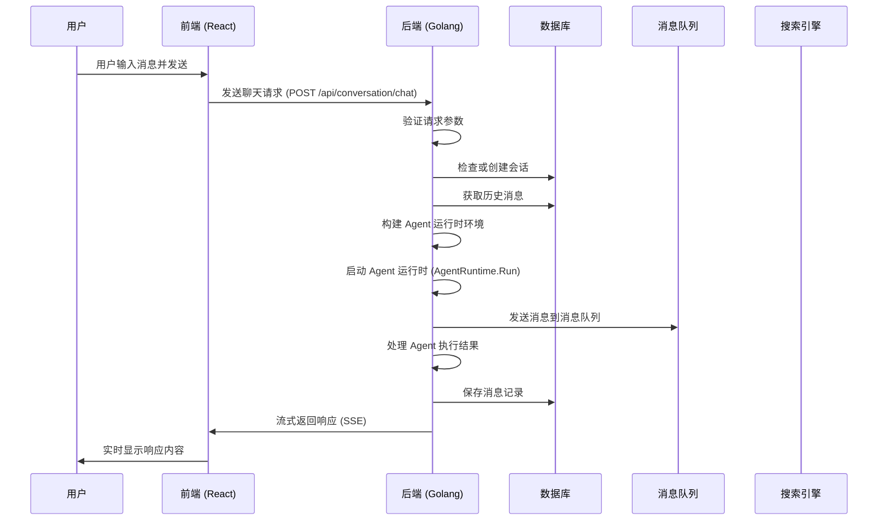

# Coze Studio 聊天 API 实现逻辑分析

## 概述

本文档详细分析了 Coze Studio 中聊天 API（`/api/conversation/chat`）的实现逻辑，包括前端和后端的完整流程。该 API 是 Coze Studio 中实现智能体对话功能的核心接口，支持流式响应和多种消息类型。

## 技术栈

- 前端：React + TypeScript
- 后端：Golang + Hertz 框架
- 数据库：GORM + MySQL/OceanBase
- 流式传输：Server-Sent Events (SSE)
- 消息队列：RocketMQ
- 搜索引擎：Elasticsearch

## 聊天流程概览



## 前端实现

### 聊天请求发送

前端通过 [DeveloperApi.Chat](../../frontend/packages/arch/idl/src/auto-generated/developer_api/index.ts#L3295-L3320) 方法发送聊天请求到后端：

```typescript
/**
 * POST /api/conversation/chat
 *
 * --------------------------------------------conversation--------------------------------------------
 */
Chat(
  req: developer_api.ChatRequest,
  options?: T,
): Promise<developer_api.ChatResponse> {
  const _req = req;
  const url = this.genBaseURL('/api/conversation/chat');
  const method = 'POST';
  const data = {
    bot_id: _req['bot_id'],
    conversation_id: _req['conversation_id'],
    bot_version: _req['bot_version'],
    user: _req['user'],
    query: _req['query'],
    chat_history: _req['chat_history'],
    extra: _req['extra'],
    stream: _req['stream'],
    custom_variables: _req['custom_variables'],
    draft_mode: _req['draft_mode'],
    scene: _req['scene'],
    content_type: _req['content_type'],
    regen_message_id: _req['regen_message_id'],
    local_message_id: _req['local_message_id'],
    preset_bot: _req['preset_bot'],
    insert_history_message_list: _req['insert_history_message_list'],
    device_id: _req['device_id'],
    space_id: _req['space_id'],
    mention_list: _req['mention_list'],
    toolList: _req['toolList'],
    commit_version: _req['commit_version'],
    sub_scene: _req['sub_scene'],
    diff_mode_identifier: _req['diff_mode_identifier'],
  };
  return this.request({ url, method, data }, options);
}
```

### 关键参数说明

- [bot_id](../../idl/app/developer_api.thrift#L8-L8): 智能体 ID
- [conversation_id](../../idl/app/developer_api.thrift#L2-L2): 会话 ID
- [query](../../idl/app/developer_api.thrift#L5-L5): 用户输入内容
- [scene](../../idl/app/developer_api.thrift#L14-L14): 场景标识
- [content_type](../../idl/app/developer_api.thrift#L17-L17): 内容类型（文本、图片、文件等）
- [draft_mode](../../idl/app/developer_api.thrift#L15-L15): 草稿模式
- [toolList](../../idl/app/developer_api.thrift#L25-L25): 工具列表

### 前端聊天组件

前端聊天组件主要位于 [open-chat](../../frontend/packages/studio/open-platform/open-chat/src/chat/web-sdk/index.tsx#L47-L148) 模块中，通过 [StudioChatProviderProps](../../frontend/packages/studio/open-platform/open-chat/src/types/props.ts#L170-L206) 配置聊天参数，并使用 [ChatArea](../../frontend/packages/common/chat-area/chat-core/src/chat-area.tsx#L81-L274) 组件处理聊天界面。

## 后端实现

### API 路由

聊天 API 的路由定义在 [backend/api/router/coze/api.go](../../backend/api/router/coze/api.go) 中：

```go
_conversation.POST("/chat", append(_agentrunMw(), coze.AgentRun)...)
```

### API 处理函数

API 处理函数位于 [backend/api/handler/coze/agent_run_service.go](../../backend/api/handler/coze/agent_run_service.go)：

```go
// AgentRun .
// @router /api/conversation/chat [POST]
func AgentRun(ctx context.Context, c *app.RequestContext) {
	var err error
	var req run.AgentRunRequest

	err = c.BindAndValidate(&req)
	if err != nil {
		invalidParamRequestResponse(c, err.Error())
		return
	}

	if checkErr := checkParams(ctx, &req); checkErr != nil {
		invalidParamRequestResponse(c, checkErr.Error())
		return
	}

	sseSender := sseImpl.NewSSESender(sse.NewStream(c))
	c.SetStatusCode(http.StatusOK)
	c.Response.Header.Set("X-Accel-Buffering", "no")

	err = conversation.ConversationSVC.Run(ctx, sseSender, &req)
	if err != nil {
		errData := run.ErrorData{
			Code: errno.ErrConversationAgentRunError,
			Msg:  err.Error(),
		}
		ed, _ := json.Marshal(errData)
		_ = sseSender.Send(ctx, &sse.Event{
			Event: run.RunEventError,
			Data:  ed,
		})
	}
}
```

### 应用层服务

应用层服务位于 [backend/application/conversation/agent_run.go](../../backend/application/conversation/agent_run.go)，主要处理聊天请求的业务逻辑：

```go
func (c *ConversationApplicationService) Run(ctx context.Context, sseSender *sseImpl.SSenderImpl, ar *run.AgentRunRequest) error {
	agentInfo, caErr := c.checkAgent(ctx, ar)
	if caErr != nil {
		logs.CtxErrorf(ctx, "checkAgent err:%v", caErr)
		return caErr
	}

	userID := ctxutil.MustGetUIDFromCtx(ctx)
	conversationData, ccErr := c.checkConversation(ctx, ar, userID)

	if ccErr != nil {
		logs.CtxErrorf(ctx, "checkConversation err:%v", ccErr)
		return ccErr
	}

	// 处理重新生成消息的逻辑
	if ar.RegenMessageID != nil && ptr.From(ar.RegenMessageID) > 0 {
		// ...
	}

	// 处理快捷命令
	var shortcutCmd *cmdEntity.ShortcutCmd
	if ar.GetShortcutCmdID() > 0 {
		// ...
	}

	// 构建 Agent 运行参数
	arr, err := c.buildAgentRunRequest(ctx, ar, userID, agentInfo.SpaceID, conversationData, shortcutCmd)
	if err != nil {
		logs.CtxErrorf(ctx, "buildAgentRunRequest err:%v", err)
		return err
	}

	// 启动 Agent 运行
	streamer, err := c.AgentRunDomainSVC.AgentRun(ctx, arr)
	if err != nil {
		return err
	}
	c.pullStream(ctx, sseSender, streamer, ar)
	return nil
}
```

### 领域层服务

领域层服务位于 [backend/domain/conversation/agentrun/service/agent_run_impl.go](../../backend/domain/conversation/agentrun/service/agent_run_impl.go)：

```go
func (c *runImpl) AgentRun(ctx context.Context, arm *entity.AgentRunMeta) (*schema.StreamReader[*entity.AgentRunResponse], error) {
	sr, sw := schema.Pipe[*entity.AgentRunResponse](20)

	defer func() {
		if pe := recover(); pe != nil {
			logs.CtxErrorf(ctx, "panic recover: %v\n, [stack]:%v", pe, string(debug.Stack()))
			return
		}
	}()

	art := &internal.AgentRuntime{
		StartTime:     time.Now(),
		RunMeta:       arm,
		SW:            sw,
		MessageEvent:  internal.NewMessageEvent(),
		RunProcess:    internal.NewRunProcess(c.RunRecordRepo),
		RunRecordRepo: c.RunRecordRepo,
		ImagexClient:  c.ImagexSVC,
	}
	safego.Go(ctx, func() {
		defer sw.Close()
		_ = art.Run(ctx)
	})

	return sr, nil
}
```

### Agent 运行时

Agent 运行时逻辑在 [backend/domain/conversation/agentrun/internal/run.go](../../backend/domain/conversation/agentrun/internal/run.go) 中实现：

```go
func (art *AgentRuntime) Run(ctx context.Context) (err error) {
	mh := &MessageEventHandler{
		messageEvent: art.MessageEvent,
		sw:           art.SW,
	}

	// 获取 Agent 信息
	agentInfo, err := getAgentInfo(ctx, art.GetRunMeta().AgentID, art.GetRunMeta().IsDraft, art.GetRunMeta().ConnectorID)
	if err != nil {
		return
	}

	art.SetAgentInfo(agentInfo)

	// 处理附加消息
	if len(art.GetRunMeta().AdditionalMessages) > 0 {
		var additionalRunRecord *entity.RunRecordMeta
		additionalRunRecord, err = art.RunRecordRepo.Create(ctx, art.GetRunMeta())
		if err != nil {
			return
		}
		err = mh.ParseAdditionalMessages(ctx, art, additionalRunRecord)
		if err != nil {
			return
		}
	}

	// 获取历史消息
	history, err := art.getHistory(ctx)
	if err != nil {
		return
	}

	// 创建运行记录
	runRecord, err := art.createRunRecord(ctx)
	if err != nil {
		return
	}

	art.SetRunRecord(runRecord)
	art.SetHistoryMsg(history)

	// 处理运行完成或失败的情况
	defer func() {
		srRecord := buildSendRunRecord(ctx, runRecord, entity.RunStatusCompleted)
		if err != nil {
			srRecord.Error = &entity.RunError{
				Code: errno.ErrConversationAgentRunError,
				Msg:  err.Error(),
			}
			art.RunProcess.StepToFailed(ctx, srRecord, art.SW)
			return
		}
		art.RunProcess.StepToComplete(ctx, srRecord, art.SW, art.GetUsage())
	}()

	// 处理用户输入
	input, err := mh.HandlerInput(ctx, art)
	if err != nil {
		return
	}
	art.SetInput(input)
	art.SetQuestionMsgID(input.ID)

	// 根据 Agent 模式选择执行方式
	if art.GetAgentInfo().BotMode == bot_common.BotMode_WorkflowMode {
		err = art.ChatflowRun(ctx, art.ImagexClient)
	} else {
		err = art.AgentStreamExecute(ctx, art.ImagexClient)
	}
	return
}
```

### ChatflowRun 实现

当 Agent 处于工作流模式（[BotMode_WorkflowMode](../../frontend/packages/arch/idl/src/auto-generated/flow_bot_operation/namespaces/benefit_common.ts#L217-L217)）时，会调用 [ChatflowRun](../../backend/domain/conversation/agentrun/internal/chatflow_run.go#L32-L92) 方法执行工作流逻辑：

```go
func (art *AgentRuntime) ChatflowRun(ctx context.Context, imagex imagex.ImageX) (err error) {

	mh := &MessageEventHandler{
		sw:           art.SW,
		messageEvent: art.MessageEvent,
	}
	resumeInfo := parseResumeInfo(ctx, art.GetHistory())
	wfID, _ := strconv.ParseInt(art.GetAgentInfo().LayoutInfo.WorkflowId, 10, 64)

	if wfID == 0 {
		mh.handlerErr(ctx, errorx.New(errno.ErrAgentRunWorkflowNotFound))
		return
	}
	var wfStreamer *schema.StreamReader[*crossworkflow.WorkflowMessage]

	executeConfig := crossworkflow.ExecuteConfig{
		ID:           wfID,
		ConnectorID:  art.GetRunMeta().ConnectorID,
		ConnectorUID: art.GetRunMeta().UserID,
		AgentID:      ptr.Of(art.GetRunMeta().AgentID),
		Mode:         crossworkflow.ExecuteModeRelease,
		BizType:      crossworkflow.BizTypeAgent,
		SyncPattern:  crossworkflow.SyncPatternStream,
		From:         crossworkflow.FromLatestVersion,
	}

	if resumeInfo != nil {
		wfStreamer, err = crossworkflow.DefaultSVC().StreamResume(ctx, &crossworkflow.ResumeRequest{
			ResumeData: concatWfInput(art),
			EventID:    resumeInfo.ChatflowInterrupt.InterruptEvent.ID,
			ExecuteID:  resumeInfo.ChatflowInterrupt.ExecuteID,
		}, executeConfig)
	} else {
		executeConfig.ConversationID = &art.GetRunMeta().ConversationID
		executeConfig.SectionID = &art.GetRunMeta().SectionID
		executeConfig.InitRoundID = &art.RunRecord.ID
		executeConfig.RoundID = &art.RunRecord.ID
		executeConfig.UserMessage = transMessageToSchemaMessage(ctx, []*msgEntity.Message{art.GetInput()}, imagex)[0]
		executeConfig.MaxHistoryRounds = ptr.Of(getAgentHistoryRounds(art.GetAgentInfo()))
		chatInput := map[string]any{
			"USER_INPUT": concatWfInput(art),
		}
		if art.GetRunMeta().ChatflowParameters != nil {
			for k, v := range art.GetRunMeta().ChatflowParameters {
				chatInput[k] = v
			}
		}
		wfStreamer, err = crossworkflow.DefaultSVC().StreamExecute(ctx, executeConfig, chatInput)
	}
	if err != nil {
		return err
	}

	var wg sync.WaitGroup
	wg.Add(1)
	safego.Go(ctx, func() {
		defer wg.Done()
		art.pullWfStream(ctx, wfStreamer, mh)
	})
	wg.Wait()
	return err
}
```

工作流执行过程中，通过 [pullWfStream](../../backend/domain/conversation/agentrun/internal/chatflow_run.go#L122-L220) 方法处理工作流返回的流式消息：

```go
func (art *AgentRuntime) pullWfStream(ctx context.Context, events *schema.StreamReader[*crossworkflow.WorkflowMessage], mh *MessageEventHandler) {

	fullAnswerContent := bytes.NewBuffer([]byte{})
	var usage *msgEntity.UsageExt

	preAnswerMsg, cErr := preCreateAnswer(ctx, art)

	if cErr != nil {
		return
	}

	var preMsgIsFinish = false
	var lastAnswerMsg *entity.ChunkMessageItem

	for {
		st, re := events.Recv()
		if re != nil {
			if errors.Is(re, io.EOF) {

				if lastAnswerMsg != nil && usage != nil {
					art.SetUsage(&agentrun.Usage{
						LlmPromptTokens:     usage.InputTokens,
						LlmCompletionTokens: usage.OutputTokens,
						LlmTotalTokens:      usage.TotalCount,
					})
					_ = mh.handlerWfUsage(ctx, lastAnswerMsg, usage)
				}

				finishErr := mh.handlerFinalAnswerFinish(ctx, art)
				if finishErr != nil {
					logs.CtxErrorf(ctx, "handlerFinalAnswerFinish error: %v", finishErr)
					return
				}
				return
			}
			logs.CtxErrorf(ctx, "pullWfStream Recv error: %v", re)
			mh.handlerErr(ctx, re)
			return
		}
		if st == nil {
			continue
		}
		if st.StateMessage != nil {
			if st.StateMessage.Status == crossworkflow.WorkflowFailed {
				mh.handlerErr(ctx, st.StateMessage.LastError)
				continue
			}
			if st.StateMessage.Usage != nil {
				usage = &msgEntity.UsageExt{
					InputTokens:  st.StateMessage.Usage.InputTokens,
					OutputTokens: st.StateMessage.Usage.OutputTokens,
					TotalCount:   st.StateMessage.Usage.InputTokens + st.StateMessage.Usage.OutputTokens,
				}
			}

			if st.StateMessage.InterruptEvent != nil { // interrupt
				mh.handlerWfInterruptMsg(ctx, st.StateMessage, art)
				continue
			}

		}

		if st.DataMessage == nil {
			continue
		}

		switch st.DataMessage.Type {
		case crossworkflow.Answer:

			// input node & question node skip
			if st.DataMessage != nil && (st.DataMessage.NodeType == crossworkflow.NodeTypeInputReceiver || st.DataMessage.NodeType == crossworkflow.NodeTypeQuestion) {
				break
			}

			if preMsgIsFinish {
				preAnswerMsg, cErr = preCreateAnswer(ctx, art)
				if cErr != nil {
					return
				}
				preMsgIsFinish = false
			}
			if st.DataMessage.Content != "" {
				fullAnswerContent.WriteString(st.DataMessage.Content)
			}

			sendAnswerMsg := buildSendMsg(ctx, preAnswerMsg, false, art)
			sendAnswerMsg.Content = st.DataMessage.Content

			mh.messageEvent.SendMsgEvent(entity.RunEventMessageDelta, sendAnswerMsg, mh.sw)

			if st.DataMessage.Last {
				preMsgIsFinish = true
				sendAnswerMsg := buildSendMsg(ctx, preAnswerMsg, false, art)
				sendAnswerMsg.Content = fullAnswerContent.String()
				fullAnswerContent.Reset()
				hfErr := mh.handlerAnswer(ctx, sendAnswerMsg, usage, art, preAnswerMsg)
				if hfErr != nil {
					return
				}
				lastAnswerMsg = sendAnswerMsg
			}
		}
	}
}
```

### AgentStreamExecute 实现

当 Agent 处于单智能体模式时，会调用 [AgentStreamExecute](../../backend/domain/conversation/agentrun/internal/singleagent_run.go#L31-L78) 方法执行智能体逻辑：

```go
func (art *AgentRuntime) AgentStreamExecute(ctx context.Context, imagex imagex.ImageX) (err error) {
	mainChan := make(chan *entity.AgentRespEvent, 100)

	ar := &crossagent.AgentRuntime{
		AgentVersion:     art.GetRunMeta().Version,
		SpaceID:          art.GetRunMeta().SpaceID,
		AgentID:          art.GetRunMeta().AgentID,
		IsDraft:          art.GetRunMeta().IsDraft,
		UserID:           art.GetRunMeta().UserID,
		ConversationId:   art.GetRunMeta().ConversationID,
		ConnectorID:      art.GetRunMeta().ConnectorID,
		PreRetrieveTools: art.GetRunMeta().PreRetrieveTools,
		CustomVariables:  art.GetRunMeta().CustomVariables,
		Input:            transMessageToSchemaMessage(ctx, []*msgEntity.Message{art.GetInput()}, imagex)[0],
		HistoryMsg:       transMessageToSchemaMessage(ctx, historyPairs(art.GetHistory()), imagex),
		ResumeInfo:       parseResumeInfo(ctx, art.GetHistory()),
	}

	streamer, err := crossagent.DefaultSVC().StreamExecute(ctx, ar)
	if err != nil {
		return errors.New(errorx.ErrorWithoutStack(err))
	}

	var wg sync.WaitGroup
	wg.Add(2)
	safego.Go(ctx, func() {
		defer wg.Done()
		art.pull(ctx, mainChan, streamer)
	})

	safego.Go(ctx, func() {
		defer wg.Done()
		art.push(ctx, mainChan)
	})

	wg.Wait()

	return err
}
```

[AgentStreamExecute](../../backend/domain/conversation/agentrun/internal/singleagent_run.go#L31-L78) 采用生产者-消费者模式处理智能体返回的流式消息。[pull](../../backend/domain/conversation/agentrun/internal/singleagent_run.go#L329-L375) 方法作为生产者，从智能体获取流式响应并放入通道中；[push](../../backend/domain/conversation/agentrun/internal/singleagent_run.go#L82-L327) 方法作为消费者，从通道中读取消息并进行处理。

```go
func (art *AgentRuntime) pull(_ context.Context, mainChan chan *entity.AgentRespEvent, events *schema.StreamReader[*crossagent.AgentEvent]) {
	defer func() {
		close(mainChan)
	}()

	for {
		rm, re := events.Recv()
		if re != nil {
			errChunk := &entity.AgentRespEvent{
				Err: re,
			}
			mainChan <- errChunk
			return
		}

		eventType, tErr := transformEventMap(rm.EventType)

		if tErr != nil {
			errChunk := &entity.AgentRespEvent{
				Err: tErr,
			}
			mainChan <- errChunk
			return
		}

		respChunk := &entity.AgentRespEvent{
			EventType:    eventType,
			ModelAnswer:  rm.ChatModelAnswer,
			ToolsMessage: rm.ToolsMessage,
			FuncCall:     rm.FuncCall,
			Knowledge:    rm.Knowledge,
			Suggest:      rm.Suggest,
			Interrupt:    rm.Interrupt,

			ToolMidAnswer: rm.ToolMidAnswer,
			ToolAsAnswer:  rm.ToolAsChatModelAnswer,
		}

		mainChan <- respChunk
	}
}
```

[push](../../backend/domain/conversation/agentrun/internal/singleagent_run.go#L82-L327) 方法处理各种类型的事件消息，包括模型回答、工具调用、知识库检索结果等：

```go
func (art *AgentRuntime) push(ctx context.Context, mainChan chan *entity.AgentRespEvent) {

	mh := &MessageEventHandler{
		sw:           art.SW,
		messageEvent: art.MessageEvent,
	}

	var err error
	defer func() {
		if err != nil {
			logs.CtxErrorf(ctx, "run.push error: %v", err)
			mh.handlerErr(ctx, err)
		}
	}()

	reasoningContent := bytes.NewBuffer([]byte{})

	var firstAnswerMsg *msgEntity.Message
	var reasoningMsg *msgEntity.Message
	isSendFinishAnswer := false
	var preToolResponseMsg *msgEntity.Message
	toolResponseMsgContent := bytes.NewBuffer([]byte{})
	for {
		chunk, ok := <-mainChan
		if !ok || chunk == nil {
			return
		}

		if chunk.Err != nil {
			if errors.Is(chunk.Err, io.EOF) {
				if !isSendFinishAnswer {
					isSendFinishAnswer = true
					if firstAnswerMsg != nil && len(reasoningContent.String()) > 0 {
						art.saveReasoningContent(ctx, firstAnswerMsg, reasoningContent.String())
						reasoningContent.Reset()
					}

					finishErr := mh.handlerFinalAnswerFinish(ctx, art)
					if finishErr != nil {
						err = finishErr
						return
					}
				}
				return
			}
			mh.handlerErr(ctx, chunk.Err)
			return
		}

		switch chunk.EventType {
		case message.MessageTypeFunctionCall:
			// 处理函数调用
		case message.MessageTypeToolResponse:
			// 处理工具响应
		case message.MessageTypeKnowledge:
			// 处理知识库消息
		case message.MessageTypeToolMidAnswer:
			// 处理工具中间答案
		case message.MessageTypeToolAsAnswer:
			// 处理工具作为答案
		case message.MessageTypeAnswer:
			// 处理模型回答
		case message.MessageTypeFlowUp:
			// 处理流程结束和建议
		case message.MessageTypeInterrupt:
			// 处理中断
		}
	}
}
```

### 流式响应处理

应用层通过 [pullStream](../../backend/application/conversation/agent_run.go#L109-L142) 方法处理来自领域层的流式响应：

```go
func (c *ConversationApplicationService) pullStream(ctx context.Context, sseSender *sseImpl.SSenderImpl, arStream *schema.StreamReader[*entity.AgentRunResponse], req *run.AgentRunRequest) {
	var ackMessageInfo *entity.ChunkMessageItem
	for {
		chunk, recvErr := arStream.Recv()
		if recvErr != nil {
			if errors.Is(recvErr, io.EOF) {
				return
			}
			sseSender.Send(ctx, buildErrorEvent(errno.ErrConversationAgentRunError, recvErr.Error()))
			return
		}

		switch chunk.Event {
		case entity.RunEventCreated, entity.RunEventInProgress, entity.RunEventCompleted:
		case entity.RunEventError:
			id, err := c.GenID(ctx)
			if err != nil {
				sseSender.Send(ctx, buildErrorEvent(errno.ErrConversationAgentRunError, err.Error()))
			} else {
				sseSender.Send(ctx, buildMessageChunkEvent(run.RunEventMessage, buildErrMsg(ackMessageInfo, chunk.Error, id)))
			}
		case entity.RunEventStreamDone:
			sseSender.Send(ctx, buildDoneEvent(run.RunEventDone))
		case entity.RunEventAck:
			ackMessageInfo = chunk.ChunkMessageItem
			sseSender.Send(ctx, buildMessageChunkEvent(run.RunEventMessage, buildARSM2Message(chunk, req)))
		case entity.RunEventMessageDelta, entity.RunEventMessageCompleted:
			sseSender.Send(ctx, buildMessageChunkEvent(run.RunEventMessage, buildARSM2Message(chunk, req)))
		default:
			logs.CtxErrorf(ctx, "unknown handler event:%v", chunk.Event)
		}
	}
}
```

## 消息处理流程

### 消息类型

系统支持多种消息类型：

1. 用户消息（Question）
2. 助手消息（Answer）
3. 知识库消息（Knowledge）
4. 工具调用消息（Tool）
5. 确认消息（Ack）

### 消息处理事件

系统定义了多种消息处理事件：

- [RunEventCreated](../../backend/domain/conversation/agentrun/entity/run_record.go#L32-L32): 运行创建
- [RunEventInProgress](../../backend/domain/conversation/agentrun/entity/run_record.go#L33-L33): 运行中
- [RunEventCompleted](../../backend/domain/conversation/agentrun/entity/run_record.go#L34-L34): 运行完成
- [RunEventError](../../backend/domain/conversation/agentrun/entity/run_record.go#L35-L35): 运行错误
- [RunEventStreamDone](../../backend/domain/conversation/agentrun/entity/run_record.go#L36-L36): 流完成
- [RunEventAck](../../backend/domain/conversation/agentrun/entity/run_record.go#L37-L37): 确认消息
- [RunEventMessageDelta](../../backend/domain/conversation/agentrun/entity/run_record.go#L38-L38): 消息增量
- [RunEventMessageCompleted](../../backend/domain/conversation/agentrun/entity/run_record.go#L39-L39): 消息完成

## 数据存储

### 会话记录

会话记录存储在 `conversation` 表中，包含以下关键字段：

- `id`: 会话 ID
- `agent_id`: 智能体 ID
- `user_id`: 用户 ID
- `section_id`: 区段 ID
- `created_at`: 创建时间
- `updated_at`: 更新时间

### 运行记录

运行记录存储在 `run_record` 表中，包含以下关键字段：

- `id`: 运行 ID
- `conversation_id`: 会话 ID
- `agent_id`: 智能体 ID
- `user_id`: 用户 ID
- `status`: 状态
- `created_at`: 创建时间
- `updated_at`: 更新时间

### 消息记录

消息记录存储在 `message` 表中，包含以下关键字段：

- `id`: 消息 ID
- `conversation_id`: 会话 ID
- `run_id`: 运行 ID
- `role`: 角色（用户/助手）
- `content_type`: 内容类型
- `content`: 内容
- `created_at`: 创建时间
- `updated_at`: 更新时间

## 总结

Coze Studio 的聊天 API 实现了一个完整的智能体对话系统，从前端用户交互到后端复杂的消息处理和 Agent 执行。系统采用流式响应机制，能够实时返回 Agent 的生成结果，提供良好的用户体验。通过模块化设计，系统具有良好的可扩展性和维护性。

根据 Agent 的不同模式（单智能体模式或工作流模式），系统采用不同的执行路径：
1. 工作流模式：通过 [ChatflowRun](../../backend/domain/conversation/agentrun/internal/chatflow_run.go#L32-L92) 执行工作流逻辑
2. 单智能体模式：通过 [AgentStreamExecute](../../backend/domain/conversation/agentrun/internal/singleagent_run.go#L31-L78) 执行智能体逻辑

两种模式都支持流式响应处理，能够实时返回中间结果和最终答案。