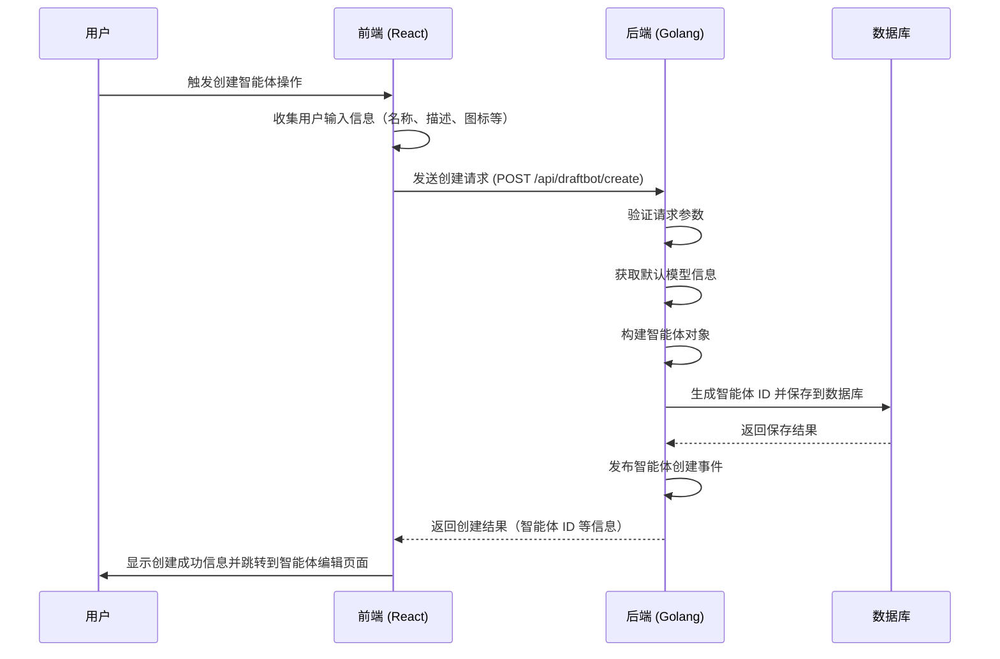

# Coze Studio 智能体创建流程分析

## 概述

本文档详细描述了 Coze Studio 中创建智能体（DraftBot）的完整流程，包括前端和后端的实现细节。智能体创建是 Coze Studio 的核心功能之一，允许用户创建和配置自己的 AI 智能体。

## 技术栈

- 前端：React + TypeScript
- 后端：Golang + Hertz 框架
- 数据库：GORM + MySQL/OceanBase
- ID 生成：分布式 ID 生成器

## 创建智能体流程概览



## 前端实现

### 创建智能体调用

前端通过 [useAgentPersistence](../../frontend/packages/agent-ide/space-bot/src/hook/use-create-bot/use-agent-persistence.ts#L61-L272) Hook 来处理智能体的创建和更新操作。创建智能体的主要逻辑如下：

```typescript
const handleCreateBot = async () => {
  const values = await getValues();
  setLoading(true);
  const paramsSpaceId =
    values?.spaceId || outerSpaceId || currentSpaceId || list?.[0]?.id || '';
  const personalSpaceInfo = list?.find(
    item => item.space_type === SpaceType.Personal,
  );
  try {
    onBefore?.();
    const resp = await DeveloperApi.DraftBotCreate({
      name: values?.name,
      description: values?.target,
      icon_uri: values?.bot_uri?.[0]?.uid,
      space_id: paramsSpaceId,
      ...(IS_OVERSEA && {
        monetization_conf: { is_enable: values?.enableMonetize },
      }),
      create_from: bizCreateFrom,
    });
    if (resp.data.check_not_pass) {
      setCheckErr(true);
      setErrMsg(resp.data.check_not_pass_msg);
      onError?.();
      return;
    }

    Toast.success({
      content: I18n.t('bot_created_toast'),
      showClose: false,
    });
    // Scenarios that are compatible with onSuccess callbacks as synchronization functions
    await onSuccess?.(resp.data?.bot_id, paramsSpaceId, {
      botName: values?.name,
      botDesc: values?.target,
      botAvatar: values?.bot_uri?.[0]?.url,
    });
    sendTeaEvent(EVENT_NAMES.click_create_bot_confirm, {
      click: 'success',
      bot_id: resp.data?.bot_id,
      create_type: 'create',
    });
    reportTea({ resp, values, personalSpaceInfo, paramsSpaceId });
    reportEvent.success();
    setVisible(false);
    return resp;
  } catch (e) {
    Toast.error({
      content: withSlardarIdButton(I18n.t('Create_failed')),
      showClose: false,
    });
    if (e instanceof Error) {
      reportEvent.error({ error: e, reason: e.message });
      sendTeaEvent(EVENT_NAMES.click_create_bot_confirm, {
        click: 'failed',
        create_type: 'create',
        error_message: e.message,
      });
    }
    onError?.();
    // Prevent pop-ups from closing
    throw e;
  } finally {
    setLoading(false);
  }
};
```

### 请求参数

前端调用后端接口时传递的参数包括：
- [name](../../idl/app/developer_api.thrift#L8-L8): 智能体名称
- [description](../../idl/app/developer_api.thrift#L9-L9): 智能体描述
- [icon_uri](../../idl/app/developer_api.thrift#L10-L10): 智能体图标 URI
- [space_id](../../idl/app/developer_api.thrift#L7-L7): 空间 ID
- [monetization_conf](../../idl/app/developer_api.thrift#L11-L11): 货币化配置（可选）
- [create_from](../../idl/app/developer_api.thrift#L12-L12): 创建来源（可选）

## 后端实现

### API 路由

创建智能体的 API 路由定义在 `backend/api/router/coze/api.go` 中：

```go
_plugin_api.POST("/api/draftbot/create", append(_draftbotcreateMw(), coze.DraftBotCreate)...)
```

### API 处理函数

API 处理函数位于 `backend/api/handler/coze/developer_api_service.go`：

```go
// DraftBotCreate .
// @router /api/draftbot/create [POST]
func DraftBotCreate(ctx context.Context, c *app.RequestContext) {
	var err error
	var req developer_api.DraftBotCreateRequest
	err = c.BindAndValidate(&req)
	if err != nil {
		invalidParamRequestResponse(c, err.Error())
		return
	}

	if req.SpaceID <= 0 {
		invalidParamRequestResponse(c, "space id is not set")
		return
	}

	if req.Name == "" {
		invalidParamRequestResponse(c, "name is nil")
		return
	}

	if req.IconURI == "" {
		invalidParamRequestResponse(c, "icon uri is nil")
		return
	}

	if utf8.RuneCountInString(req.Name) > 50 {
		invalidParamRequestResponse(c, "name is too long")
		return
	}

	if utf8.RuneCountInString(req.Description) > 2000 {
		invalidParamRequestResponse(c, "description is too long")
		return
	}

	resp, err := application.SingleAgentSVC.CreateSingleAgentDraft(ctx, &req)
	if err != nil {
		internalServerErrorResponse(ctx, c, err)
		return
	}

	c.JSON(consts.StatusOK, resp)
}
```

### 应用层服务

应用层服务位于 `backend/application/singleagent/create.go`：

```go
func (s *SingleAgentApplicationService) CreateSingleAgentDraft(ctx context.Context, req *developer_api.DraftBotCreateRequest) (*developer_api.DraftBotCreateResponse, error) {
	resp, err := s.appContext.ModelMgr.ListInUseModel(ctx, 1, nil)
	if err != nil {
		return nil, err
	}

	if len(resp.ModelList) == 0 {
		return nil, errorx.New(errno.ErrAgentNoModelInUseCode)
	}

	do, err := s.draftBotCreateRequestToSingleAgent(ctx, req)
	if err != nil {
		return nil, err
	}

	userID := ctxutil.MustGetUIDFromCtx(ctx)
	agentID, err := s.DomainSVC.CreateSingleAgentDraft(ctx, userID, do)
	if err != nil {
		return nil, err
	}

	err = s.appContext.EventBus.PublishProject(ctx, &searchEntity.ProjectDomainEvent{
		OpType: searchEntity.Created,
		Project: &searchEntity.ProjectDocument{
			Status:  intelligence.IntelligenceStatus_Using,
			Type:    intelligence.IntelligenceType_Bot,
			ID:      agentID,
			SpaceID: &req.SpaceID,
			OwnerID: &userID,
			Name:    &do.Name,
		},
	})
	if err != nil {
		return nil, err
	}

	return &developer_api.DraftBotCreateResponse{Data: &developer_api.DraftBotCreateData{
		BotID: agentID,
	}}, nil
}
```

### 领域层服务

领域层服务位于 `backend/domain/agent/singleagent/service/single_agent_impl.go`，是创建智能体流程的核心实现：

```go
func (s *singleAgentImpl) CreateSingleAgentDraft(ctx context.Context, creatorID int64, draft *entity.SingleAgent) (agentID int64, err error) {
	return s.AgentDraftRepo.Create(ctx, creatorID, draft)
}
```

实际的创建逻辑在仓库层实现。

### 仓库层实现

仓库层实现在 `backend/domain/agent/singleagent/internal/dal/single_agent_draft.go`：

```go
func (sa *SingleAgentDraftDAO) Create(ctx context.Context, creatorID int64, draft *entity.SingleAgent) (draftID int64, err error) {
	id, err := sa.idGen.GenID(ctx)
	if err != nil {
		return 0, errorx.WrapByCode(err, errno.ErrAgentIDGenFailCode, errorx.KV("msg", "CreatePromptResource"))
	}

	return sa.CreateWithID(ctx, creatorID, id, draft)
}

func (sa *SingleAgentDraftDAO) CreateWithID(ctx context.Context, creatorID, agentID int64, draft *entity.SingleAgent) (draftID int64, err error) {
	po := sa.singleAgentDraftDo2Po(draft)
	po.AgentID = agentID
	po.CreatorID = creatorID

	err = sa.dbQuery.SingleAgentDraft.WithContext(ctx).Create(po)
	if err != nil {
		return 0, errorx.WrapByCode(err, errno.ErrAgentCreateDraftCode)
	}

	return agentID, nil
}
```

### 智能体初始化

在创建智能体时，系统会为智能体设置默认配置，包括默认模型信息：

```go
func (s *SingleAgentApplicationService) newDefaultSingleAgent(ctx context.Context) (*entity.SingleAgent, error) {
	mi, err := s.defaultModelInfo(ctx)
	if err != nil {
		return nil, err
	}

	now := time.Now().UnixMilli()
	return &entity.SingleAgent{
		SingleAgent: &singleagent.SingleAgent{
			OnboardingInfo: &bot_common.OnboardingInfo{},
			ModelInfo:      mi,
			Prompt:         &bot_common.PromptInfo{},
			Plugin:         []*bot_common.PluginInfo{},
			Knowledge: &bot_common.Knowledge{
				TopK:           ptr.Of(int64(1)),
				MinScore:       ptr.Of(0.01),
				SearchStrategy: ptr.Of(bot_common.SearchStrategy_SemanticSearch),
				RecallStrategy: &bot_common.RecallStrategy{
					UseNl2sql:  ptr.Of(true),
					UseRerank:  ptr.Of(true),
					UseRewrite: ptr.Of(true),
				},
			},
			Workflow:     []*bot_common.WorkflowInfo{},
			SuggestReply: &bot_common.SuggestReplyInfo{},
			JumpConfig:   &bot_common.JumpConfig{},
			Database:     []*bot_common.Database{},

			CreatedAt: now,
			UpdatedAt: now,
		},
	}, nil
}
```

默认模型信息通过以下方式获取：

```go
func (s *SingleAgentApplicationService) defaultModelInfo(ctx context.Context) (*bot_common.ModelInfo, error) {
	modelResp, err := s.appContext.ModelMgr.ListModel(ctx, &modelmgr.ListModelRequest{
		Status: []modelmgr.ModelStatus{modelmgr.StatusInUse},
		Limit:  1,
		Cursor: nil,
	})
	if err != nil {
		return nil, err
	}

	if len(modelResp.ModelList) == 0 {
		return nil, errorx.New(errno.ErrAgentResourceNotFound, errorx.KV("type", "model"), errorx.KV("id", "default"))
	}

	dm := modelResp.ModelList[0]

	// ... 设置模型参数
}
```

## ID 生成

智能体 ID 使用与用户 ID、空间 ID 相同的分布式 ID 生成机制创建，确保在分布式系统中的唯一性。

```go
func (sa *SingleAgentDraftDAO) Create(ctx context.Context, creatorID int64, draft *entity.SingleAgent) (draftID int64, err error) {
	id, err := sa.idGen.GenID(ctx)
	if err != nil {
		return 0, errorx.WrapByCode(err, errno.ErrAgentIDGenFailCode, errorx.KV("msg", "CreatePromptResource"))
	}

	return sa.CreateWithID(ctx, creatorID, id, draft)
}
```

## 总结

Coze Studio 的智能体创建流程从前端到后端形成了完整的闭环。用户在前端填写智能体基本信息后，前端会将这些信息发送到后端。后端首先验证参数，然后获取默认模型信息并构建智能体对象，接着使用分布式 ID 生成器生成唯一 ID 并保存到数据库，最后发布智能体创建事件并返回结果给前端。

整个流程设计合理，确保了智能体创建的完整性和一致性。默认配置的设置让用户能够快速创建一个可用的智能体，而后续可以通过编辑功能进一步完善智能体的配置。