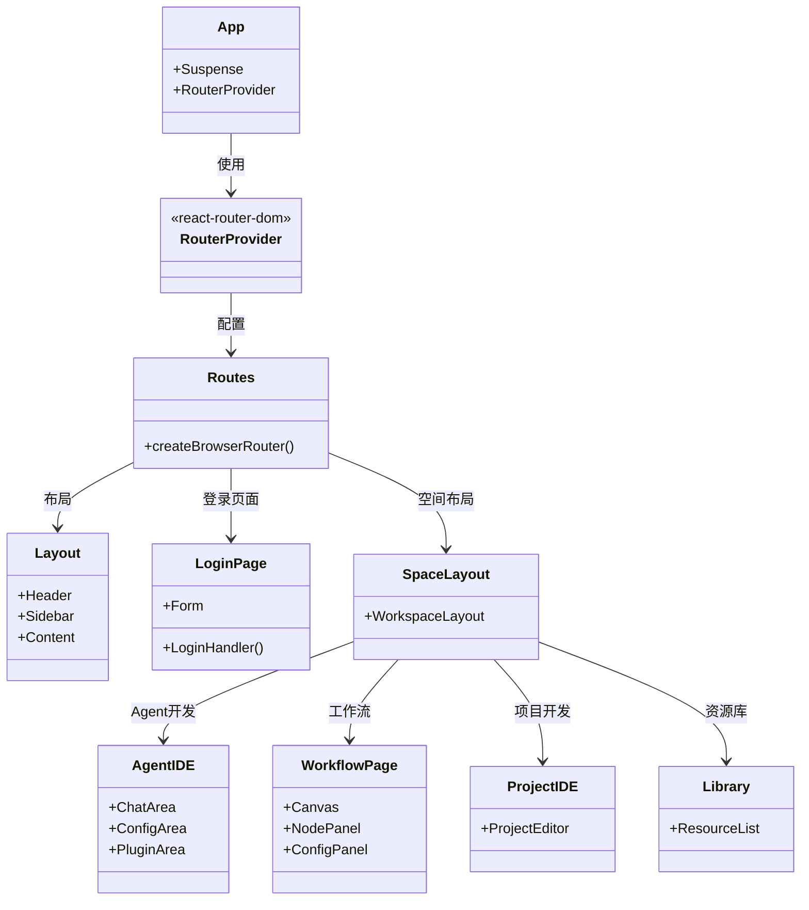
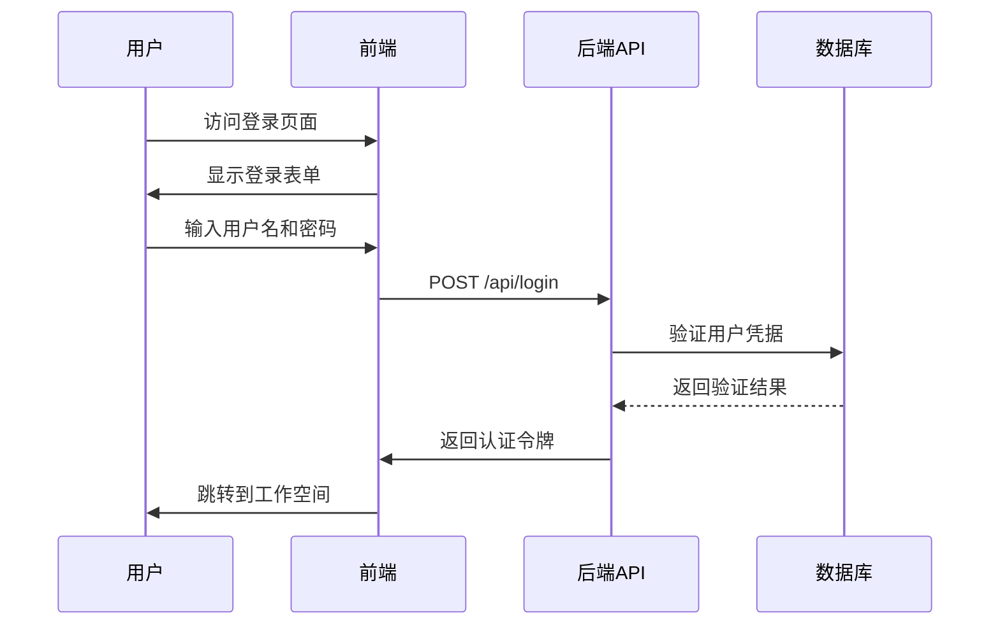
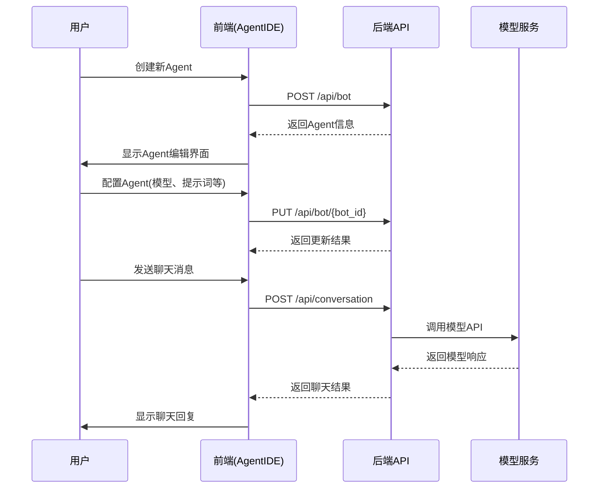
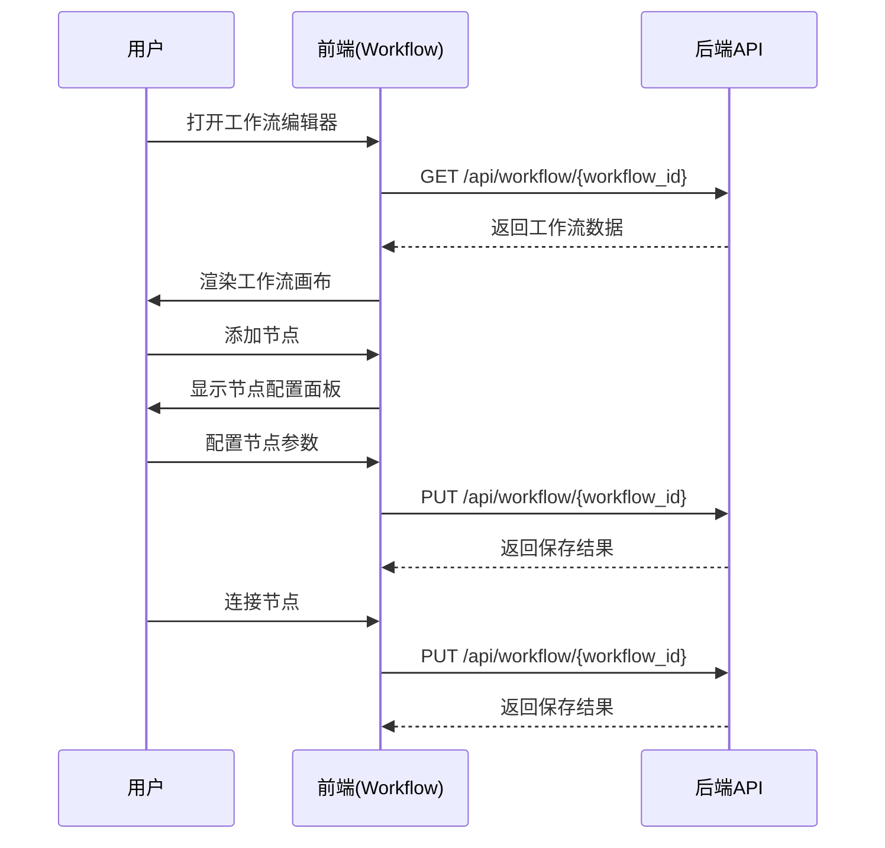

# Coze Studio 前端架构

## 1. 概述

Coze Studio 前端是一个基于 React 和 TypeScript 构建的现代化 Web 应用程序，采用组件化架构设计，支持模块化开发和维护。前端应用通过与后端 API 进行交互，为用户提供可视化的 AI Agent 开发环境。

## 2. 技术栈

- **核心框架**: React 18.x
- **语言**: TypeScript
- **路由**: react-router-dom
- **构建工具**: Rsbuild/Rspack
- **状态管理**: 未使用全局状态管理库，主要依赖组件状态和上下文
- **UI 组件库**: 自研组件库 @coze-arch/coze-design
- **样式**: Less + Tailwind CSS
- **测试**: Vitest

## 3. 项目结构

```
frontend/
├── apps/
│   └── coze-studio/           # 主应用
│       ├── src/
│       │   ├── app.tsx         # 应用根组件
│       │   ├── index.tsx       # 应用入口
│       │   ├── layout.tsx      # 布局组件
│       │   ├── routes/         # 路由配置
│       │   └── pages/          # 页面组件
│       └── ...
├── packages/                  # 组件包
│   ├── workflow/              # 工作流相关组件
│   ├── agent-ide/             # Agent 开发环境组件
│   ├── project-ide/           # 项目开发环境组件
│   ├── components/            # 公共组件
│   ├── studio/                # 核心工作室组件
│   ├── arch/                  # 架构相关组件
│   ├── foundation/            # 基础组件和工具
│   ├── common/                # 通用工具和组件
│   └── ...
└── ...
```

## 4. 核心模块

### 4.1 主应用 (coze-studio)

主应用是整个前端项目的入口，负责路由配置、整体布局和组件编排。

#### 4.1.1 路由结构

主应用采用声明式路由配置，主要路由包括：

- `/sign` - 登录页面
- `/space` - 工作空间
  - `/space/:space_id/develop` - 项目开发
  - `/space/:space_id/bot/:bot_id` - Agent IDE
  - `/space/:space_id/bot/:bot_id/publish` - Agent 发布
  - `/space/:space_id/project-ide/:project_id/*` - 项目 IDE
  - `/space/:space_id/library` - 资源库
  - `/space/:space_id/knowledge/:dataset_id` - 知识库
  - `/space/:space_id/database/:table_id` - 数据库
  - `/space/:space_id/plugin/:plugin_id` - 插件
- `/work_flow` - 工作流页面
- `/explore` - 探索页面
  - `/explore/plugin` - 插件市场
  - `/explore/template` - 模板市场

### 4.2 核心组件包

#### 4.2.1 Workflow (工作流)

提供工作流编辑器相关功能，包括节点组件、画布渲染、历史记录等。

主要目录结构：
- [adapter/](../../frontend/packages/workflow/adapter) - 适配器
- [base/](../../frontend/packages/workflow/base) - 基础组件和工具
- [components/](../../frontend/packages/workflow/components) - UI 组件
- [fabric-canvas/](../../frontend/packages/workflow/fabric-canvas) - 画布实现
- [nodes/](../../frontend/packages/workflow/nodes) - 节点组件
- [sdk/](../../frontend/packages/workflow/sdk) - SDK 接口

#### 4.2.2 Agent IDE

提供 Agent 开发环境，包括聊天界面、插件配置、模型管理等功能。

主要目录结构：
- [agent-publish/](../../frontend/packages/agent-ide/agent-publish) - Agent 发布
- [bot-config-area/](../../frontend/packages/agent-ide/bot-config-area) - Bot 配置区域
- [chat-area-provider/](../../frontend/packages/agent-ide/chat-area-provider) - 聊天区域提供者
- [model-manager/](../../frontend/packages/agent-ide/model-manager) - 模型管理
- [plugin-content/](../../frontend/packages/agent-ide/plugin-content) - 插件内容
- [prompt/](../../frontend/packages/agent-ide/prompt) - 提示词管理

#### 4.2.3 Project IDE

提供项目级别的开发环境，支持复杂应用的构建。

主要目录结构：
- [biz-components/](../../frontend/packages/project-ide/biz-components) - 业务组件
- [biz-data/](../../frontend/packages/project-ide/biz-data) - 业务数据
- [biz-workflow/](../../frontend/packages/project-ide/biz-workflow) - 业务工作流
- [core/](../../frontend/packages/project-ide/core) - 核心模块
- [view/](../../frontend/packages/project-ide/view) - 视图组件

## 5. 类图



## 6. 主要功能时序图

### 6.1 用户登录流程



### 6.2 Agent 创建与聊天流程



### 6.3 工作流编辑流程



## 7. 后端 API 调用

前端通过 HTTP RESTful API 与后端进行交互，主要 API 包括：

### 7.1 认证相关 API

- `POST /api/login` - 用户登录
- `POST /api/logout` - 用户登出
- `GET /api/user/info` - 获取用户信息

### 7.2 Agent 相关 API

- `POST /api/bot` - 创建 Agent
- `GET /api/bot/{bot_id}` - 获取 Agent 信息
- `PUT /api/bot/{bot_id}` - 更新 Agent
- `DELETE /api/bot/{bot_id}` - 删除 Agent
- `POST /api/bot/{bot_id}/publish` - 发布 Agent
- `POST /api/conversation` - 发起对话

### 7.3 工作流相关 API

- `POST /api/workflow` - 创建工作流
- `GET /api/workflow/{workflow_id}` - 获取工作流
- `PUT /api/workflow/{workflow_id}` - 更新工作流
- `DELETE /api/workflow/{workflow_id}` - 删除工作流
- `POST /api/workflow/{workflow_id}/publish` - 发布工作流

### 7.4 项目相关 API

- `POST /api/project` - 创建项目
- `GET /api/project/{project_id}` - 获取项目
- `PUT /api/project/{project_id}` - 更新项目
- `DELETE /api/project/{project_id}` - 删除项目

### 7.5 资源相关 API

- `GET /api/plugin` - 获取插件列表
- `GET /api/plugin/{plugin_id}` - 获取插件详情
- `GET /api/knowledge` - 获取知识库列表
- `GET /api/knowledge/{dataset_id}` - 获取知识库详情
- `GET /api/database` - 获取数据库列表
- `GET /api/database/{table_id}` - 获取数据表详情

### 7.6 探索相关 API

- `GET /api/explore/plugin` - 获取插件市场插件
- `GET /api/explore/template` - 获取模板市场模板

## 8. 数据流

前端与后端的数据流遵循以下模式：

1. 用户在前端界面执行操作
2. 前端通过 HTTP 请求调用后端 API
3. 后端处理请求并与数据库交互
4. 后端返回处理结果给前端
5. 前端更新界面状态并重新渲染

对于实时性要求较高的功能（如聊天），前端可能通过 WebSocket 或轮询方式获取实时数据。