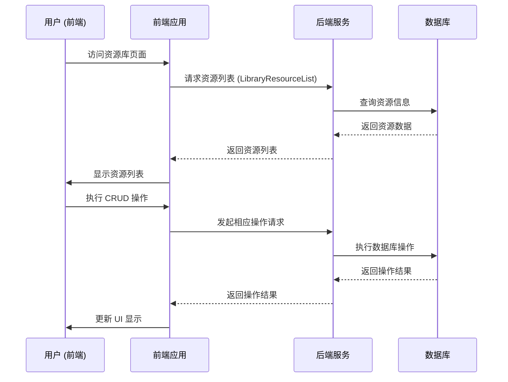

# 资源库页面 CRUD 操作分析

## 概述

本文档详细分析了 Coze Studio 资源库页面的增删改查（CRUD）操作实现。资源库页面允许用户查看、创建、更新和删除各种类型的资源，包括插件、工作流、知识库、提示词和数据库等。

## 技术栈

- 前端: React + TypeScript
- 后端: Golang + Hertz 框架
- 数据库: MySQL/OceanBase
- API 通信: Thrift RPC

## 资源库 CRUD 流程概览

### 时序图



## 前端实现

### 1. 资源库页面入口

资源库页面的入口在 [frontend/apps/coze-studio/src/pages/library.tsx](../../frontend/apps/coze-studio/src/pages/library.tsx)：

```tsx
import { useParams } from 'react-router-dom';

import { LibraryPage } from '@coze-studio/workspace-adapter/library';

const Page = () => {
  const { space_id } = useParams();
  return space_id ? <LibraryPage spaceId={space_id} /> : null;
};

export default Page;
```

### 2. 资源列表获取

在 [frontend/packages/studio/workspace/entry-base/src/pages/library/index.tsx](../../frontend/packages/studio/workspace/entry-base/src/pages/library/index.tsx) 中，使用 `useInfiniteScroll` 钩子获取资源列表：

```typescript
const listResp = useInfiniteScroll<ListData>(
  async prev => {
    if (!ready) {
      return {
        list: [],
        nextCursorId: undefined,
        hasMore: false,
      };
    }
    // Allow business to customize request parameters
    const resp = await PluginDevelopApi.LibraryResourceList(
      entityConfigs.reduce<LibraryResourceListRequest>(
        (res, config) => config.parseParams?.(res) ?? res,
        {
          ...params,
          cursor: prev?.nextCursorId,
          space_id: spaceId,
          size: LIBRARY_PAGE_SIZE,
        },
      ),
    );
    return {
      list: resp?.resource_list || [],
      nextCursorId: resp?.cursor,
      hasMore: !!resp?.has_more,
    };
  },
  {
    reloadDeps: [params, spaceId],
  },
);
```

### 3. 资源创建操作

资源创建操作根据不同资源类型有不同的实现方式。以下是各种资源类型的创建实现：

#### 3.1 插件创建

在 [frontend/packages/project-ide/biz-plugin/src/hooks/use-plugin-resource.tsx](../../frontend/packages/project-ide/biz-plugin/src/hooks/use-plugin-resource.tsx) 中定义了插件创建逻辑：

```typescript
const onCustomCreate: ResourceFolderCozeProps['onCustomCreate'] = (
  resourceType,
  subType,
) => {
  console.log('[ResourceFolder]on custom create>>>', resourceType, subType);
  setShowFormPluginModel(true);
};

// Creating plugin
const {
  modal: createFormPluginModal,
  open: openCreateFormPluginModal,
  close: closeCreateFormPluginModal,
} = CreateFormPluginModal.useModal({
  from: From.ProjectIde,
  projectId,
  onFinish: async val => {
    if (!val?.pluginId) {
      return;
    }
    await refetch?.();
    openResource({
      resourceType: BizResourceTypeEnum.Plugin,
      resourceId: val?.pluginId,
    });
    closeCreateFormPluginModal();
  },
});
```

插件创建界面使用 [CreateFormPluginModal](../../frontend/packages/agent-ide/bot-plugin/export/src/component/bot_edit/bot-form-edit/index.tsx) 组件，该组件提供了一个表单界面供用户填写插件的基本信息。

#### 3.2 工作流创建

在 [frontend/packages/project-ide/biz-workflow/src/hooks/use-workflow-resource.tsx](../../frontend/packages/project-ide/biz-workflow/src/hooks/use-workflow-resource.tsx) 中定义了工作流创建逻辑：

```typescript
const onCustomCreate: ResourceFolderCozeProps['onCustomCreate'] = (
  resourceType,
  subType,
) => {
  console.log('[ResourceFolder]on custom create>>>', resourceType, subType);
  openCreateWorkflowModal({
    mode: 'create',
    flowMode: subType as WorkflowMode,
  });
};

const createResourceConfig = useMemo(
  () =>
    [
      {
        icon: WORKFLOW_SUB_TYPE_ICON_MAP[WorkflowMode.Workflow],
        label: I18n.t('project_resource_sidebar_create_new_resource', {
          resource: I18n.t('library_resource_type_workflow'),
        }),
        subType: WorkflowMode.Workflow,
        tooltip: <WorkflowTooltip flowMode={WorkflowMode.Workflow} />,
      },
      {
        icon: WORKFLOW_SUB_TYPE_ICON_MAP[WorkflowMode.ChatFlow],
        label: I18n.t('project_resource_sidebar_create_new_resource', {
          resource: I18n.t('wf_chatflow_76'),
        }),
        subType: WorkflowMode.ChatFlow,
        tooltip: <WorkflowTooltip flowMode={WorkflowMode.ChatFlow} />,
      },
    ].filter(Boolean) as ResourceFolderCozeProps['createResourceConfig'],
  []
);
```

工作流创建界面使用 [useCreateWorkflowModal](../../frontend/packages/workflow/components/src/workflow-edit/index.tsx) 钩子，该组件提供了一个表单界面供用户填写工作流的基本信息。

#### 3.3 对话流创建

对话流实际上是在创建工作流时通过指定模式创建的，与工作流创建使用相同的入口，只是 [WorkflowMode](../../frontend/packages/arch/idl/src/auto-generated/workflow_api/namespaces/workflow.ts#L35-L42) 不同：

```typescript
// 在工作流创建中指定 WorkflowMode.ChatFlow
openCreateWorkflowModal({
  mode: 'create',
  flowMode: WorkflowMode.ChatFlow, // 对话流模式
});
```

对话流创建界面与工作流创建界面相同，都是使用 [useCreateWorkflowModal](../../frontend/packages/workflow/components/src/workflow-edit/index.tsx) 钩子。

#### 3.4 知识库创建

在 [frontend/packages/project-ide/biz-data/src/hooks/use-knowledge-resource.tsx](../../frontend/packages/project-ide/biz-data/src/hooks/use-knowledge-resource.tsx) 中定义了知识库创建逻辑：

```typescript
const onCustomCreate: ResourceFolderCozeProps['onCustomCreate'] = () => {
  openCreateKnowledgeModal();
};

// Creating knowledge
const {
  modal: createKnowledgeModal,
  open: openCreateKnowledgeModal,
  close,
} = useCreateKnowledgeModalV2({
  projectID,
  onFinish: (datasetID, unitType, shouldUpload) => {
    refetch();
    close();
    IDENav(
      `/knowledge/${datasetID}?type=${unitType}${
        shouldUpload ? '&module=upload' : ''
      }`,
    );
  },
});
```

知识库创建界面使用 [useCreateKnowledgeModalV2](../../frontend/packages/data/knowledge/knowledge-modal-adapter/src/create-knowledge-modal-v2/scenes/base/index.tsx) 钩子，该组件提供了一个表单界面供用户填写知识库的基本信息。

#### 3.5 提示词创建

在 [frontend/packages/project-ide/biz-prompt/src/hooks/use-prompt-resource.tsx](../../frontend/packages/project-ide/biz-prompt/src/hooks/use-prompt-resource.tsx) 中定义了提示词创建逻辑：

```typescript
const onCustomCreate: ResourceFolderCozeProps['onCustomCreate'] = () => {
  openCreatePromptModal();
};

const {
  modal: createPromptModal,
  open: openCreatePromptModal,
  close: closeCreatePromptModal,
} = useCreatePromptModal({
  spaceID,
  projectID,
  onSuccess: async (id, name) => {
    await refetch?.();
    closeCreatePromptModal();
    openResource({
      resourceType: BizResourceTypeEnum.Prompt,
      resourceId: id,
    });
  },
});
```

提示词创建界面使用 [useCreatePromptModal](../../frontend/packages/prompt/components/src/create-prompt-modal/index.tsx) 钩子，该组件提供了一个表单界面供用户填写提示词的基本信息。

#### 3.6 数据库创建

在 [frontend/packages/project-ide/biz-data/src/hooks/use-database-resource.tsx](../../frontend/packages/project-ide/biz-data/src/hooks/use-database-resource.tsx) 中定义了数据库创建逻辑：

```typescript
const onCustomCreate: ResourceFolderCozeProps['onCustomCreate'] = (
  resourceType,
  subType,
) => {
  console.log('[ResourceFolder]on custom create>>>', resourceType, subType);
  openCreateDatabaseModal();
};

// Create Database
const {
  modal: createDatabaseModal,
  open: openCreateDatabaseModal,
  close: closeCreateDatabaseModal,
} = useLibraryCreateDatabaseModal({
  projectID: projectId,
  enterFrom: 'project',
  onFinish: databaseID => {
    refetch();
    closeCreateDatabaseModal();
    IDENav(`/database/${databaseID}?page_modal=normal&from=create`);
  },
});
```

数据库创建界面使用 [useLibraryCreateDatabaseModal](../../frontend/packages/data/database/database-v2/src/create-database-modal/index.tsx) 钩子，该组件提供了一个表单界面供用户填写数据库的基本信息。

### 4. 资源创建操作的触发方式

资源创建操作的触发主要通过 [ResourceFolderCoze](../../frontend/packages/project-ide/biz-components/src/resource-folder-coze/resource-folder-coze.tsx) 组件实现。该组件提供了多种触发资源创建的方式：

#### 4.1 通过右键菜单触发

用户可以通过右键点击资源文件夹，在弹出的上下文菜单中选择"创建资源"选项来触发资源创建操作。

#### 4.2 通过工具栏按钮触发

用户可以通过点击资源文件夹顶部工具栏中的"创建资源"按钮来触发资源创建操作。

#### 4.3 通过快捷键触发

用户可以通过使用快捷键（通常是 `Ctrl+N` 或 `Cmd+N`）来触发资源创建操作。

#### 4.4 通过拖拽创建

用户可以通过将外部文件拖拽到资源文件夹中来触发资源创建操作。

在 [frontend/packages/project-ide/biz-components/src/resource-folder-coze/resource-folder-coze.tsx](../../frontend/packages/project-ide/biz-components/src/resource-folder-coze/resource-folder-coze.tsx) 中，定义了处理创建资源的逻辑：

```typescript
const handleCreateResource = (
  _groupType: BizGroupTypeWithFolder,
  subType?: ResourceSubType,
) => {
  if (!canCreate) {
    return;
  }
  handleExpandChange(true);
  if (_groupType === ResourceTypeEnum.Folder) {
    ref.current?.createFolder();
  } else {
    if (onCustomCreate) {
      onCustomCreate(_groupType, subType);
    } else if (defaultResourceType) {
      creatingResourceSubTypeRef.current = subType;
      ref.current?.createResource(defaultResourceType);
    } else {
      console.error(
        '[ResourceFolderCoze]must specify defaultResourceType when use props onCreate creating resource',
      );
    }
  }
};
```

### 5. 点击资源后的操作

在资源库页面中，用户可以通过点击资源来查看资源详情或进行相关操作。在 [frontend/packages/studio/workspace/entry-base/src/pages/library/index.tsx](../../frontend/packages/studio/workspace/entry-base/src/pages/library/index.tsx) 中，定义了点击资源后的处理逻辑：

```typescript
// Click on the whole line
onRow: (record?: ResourceInfo) => {
  if (
    !record ||
    record.res_type === undefined ||
    record.detail_disable
  ) {
    return {};
  }
  return {
    onClick: () => {
      sendTeaEvent(EVENT_NAMES.workspace_action_front, {
        space_id: spaceId,
        space_type: isPersonalSpace ? 'personal' : 'teamspace',
        tab_name: 'library',
        action: 'click',
        id: record.res_id,
        name: record.name,
        type:
          record.res_type && eventLibraryType[record.res_type],
      });
      entityConfigs
        .find(c => c.target.includes(record.res_type as ResType))
        ?.onItemClick(record);
    },
  };
},
```

不同的资源类型有不同的点击处理逻辑，这些逻辑在 [LibraryEntityConfig](../../frontend/packages/studio/workspace/entry-base/src/pages/library/types.ts#L24-L92) 中定义。以下是各种资源类型的点击处理实现：

#### 5.1 插件资源点击

在 [frontend/packages/project-ide/biz-plugin/src/hooks/use-library-plugin-resource.tsx](../../frontend/packages/project-ide/biz-plugin/src/hooks/use-library-plugin-resource.tsx) 中定义了插件资源点击逻辑：

```typescript
onItemClick: record => {
  const id = record.res_id;
  if (!id) {
    return;
  }
  window.open(`/space/${spaceId}/plugin/${id}`, '_blank');
},
```

#### 5.2 工作流资源点击

在 [frontend/packages/workflow/components/src/hooks/use-workflow-resource-action/use-workflow-resource-click.ts](../../frontend/packages/workflow/components/src/hooks/use-workflow-resource-action/use-workflow-resource-click.ts) 中定义了工作流资源点击逻辑：

```typescript
const handleWorkflowResourceClick = (record: ResourceInfo) => {
  reporter.info({
    message: 'workflow_list_click_row',
  });
  onEditWorkFlow(record?.res_id);
};

const onEditWorkFlow = (workflowId?: string) => {
  reporter.info({
    message: 'workflow_list_edit_row',
    meta: {
      workflowId,
    },
  });
  goWorkflowDetail(workflowId, spaceId);
};

/** Open the process edit page */
const goWorkflowDetail = (workflowId?: string, sId?: string) => {
  if (!workflowId || !sId) {
    return;
  }
  reporter.info({
    message: 'workflow_list_navigate_to_detail',
    meta: {
      workflowId,
    },
  });

  navigate(`/work_flow?workflow_id=${workflowId}&space_id=${sId}`);
};
```

#### 5.3 知识库资源点击

在 [frontend/packages/project-ide/biz-data/src/hooks/use-library-knowledge-resource.tsx](../../frontend/packages/project-ide/biz-data/src/hooks/use-library-knowledge-resource.tsx) 中定义了知识库资源点击逻辑：

```typescript
onItemClick: record => {
  const id = record.res_id;
  if (!id) {
    return;
  }
  window.open(`/space/${spaceId}/knowledge/${id}`, '_blank');
},
```

#### 5.4 提示词资源点击

在 [frontend/packages/project-ide/biz-prompt/src/hooks/use-library-prompt-resource.tsx](../../frontend/packages/project-ide/biz-prompt/src/hooks/use-library-prompt-resource.tsx) 中定义了提示词资源点击逻辑：

```typescript
onItemClick: record => {
  const id = record.res_id;
  if (!id) {
    return;
  }
  window.open(
    `/space/${spaceId}/playground/prompt/${id}`,
    '_blank',
  );
},
```

#### 5.5 数据库资源点击

在 [frontend/packages/project-ide/biz-data/src/hooks/use-library-database-resource.tsx](../../frontend/packages/project-ide/biz-data/src/hooks/use-library-database-resource.tsx) 中定义了数据库资源点击逻辑：

```typescript
onItemClick: record => {
  const id = record.res_id;
  if (!id) {
    return;
  }
  window.open(`/space/${spaceId}/database/${id}`, '_blank');
},
```

### 6. 资源更新操作

同样以数据库资源为例，资源重命名操作：

```typescript
const onChangeName: ResourceFolderProps['onChangeName'] =
  async changeNameEvent => {
    try {
      console.log('[ResourceFolder]on change name>>>', changeNameEvent);
      const resp = await MemoryApi.UpdateDatabase({
        id: changeNameEvent.id,
        table_name: changeNameEvent.name,
      });
      console.log('[ResourceFolder]rename database response>>>', resp);
    } catch (e) {
      console.log('[ResourceFolder]rename database error>>>', e);
    } finally {
      refetch();
    }
  };
```

### 7. 资源删除操作

数据库资源删除操作：

```typescript
const onDelete = useCallback(
  async (resources: ResourceType[]) => {
    try {
      console.log('[ResourceFolder]on delete>>>', resources);
      const resp = await MemoryApi.DeleteDatabase({
        id: resources.filter(
          r => r.type === BizResourceTypeEnum.Database,
        )?.[0].res_id,
      });
      Toast.success(I18n.t('Delete_success'));
      refetch();
      console.log('[ResourceFolder]delete database response>>>', resp);
    } catch (e) {
      console.log('[ResourceFolder]delete database error>>>', e);
      Toast.error(I18n.t('Delete_failed'));
    }
  },
  [refetch, spaceId],
);
```

### 8. 资源复制/移动操作

资源复制和移动操作通过 `ResourceCopyDispatch` 接口实现：

```typescript
const resourceOperation = useResourceOperation({ projectId });
const onAction = (
  action: BizResourceContextMenuBtnType,
  resource?: BizResourceType,
) => {
  console.log('on action>>>', action, resource);
  switch (action) {
    case BizResourceContextMenuBtnType.ImportLibraryResource:
      // return importLibrary();
      // return openDatabase();
      return;
    case BizResourceContextMenuBtnType.DuplicateResource:
      return resourceOperation({
        scene: ResourceCopyScene.CopyProjectResource,
        resource,
      });
    case BizResourceContextMenuBtnType.MoveToLibrary:
      return resourceOperation({
        scene: ResourceCopyScene.MoveResourceToLibrary,
        resource,
      });
    case BizResourceContextMenuBtnType.CopyToLibrary:
      return resourceOperation({
        scene: ResourceCopyScene.CopyResourceToLibrary,
        resource,
      });
    default:
      console.warn('[DatabaseResource]unsupported action>>>', action);
      break;
  }
};
```

## 后端实现

### 1. 资源列表接口

在 [idl/resource/resource.thrift](../../idl/resource/resource.thrift) 中定义了资源库列表接口：

```thrift
service ResourceService {
    LibraryResourceListResponse LibraryResourceList(1: LibraryResourceListRequest request)(api.post='/api/plugin_api/library_resource_list', api.category="resource", api.gen_path="resource", agw.preserve_base="true")
    // ...
}
```

对应的请求和响应结构：

```thrift
struct LibraryResourceListRequest {
    1  : optional i32          user_filter          , // 是否由当前用户创建，0-不筛选，1-当前用户
    2  : optional list<resource_common.ResType>    res_type_filter      , // [4,1]   0代表不筛选
    3  : optional string       name                 , // 名称
    4  : optional resource_common.PublishStatus          publish_status_filter, // 发布状态，0-不筛选，1-未发布，2-已发布
    5  : required i64          space_id (agw.js_conv="str", api.js_conv="true"), // 用户所在空间ID
    7  : optional i32          size                 , // 一次读取的数据条数，默认10，最大100.
    9  : optional string       cursor               , // 游标，用于分页，默认0，第一次请求可以不传，后续请求需要带上上次返回的cursor
    10 : optional list<string> search_keys          , // 用来指定自定义搜索的字段 不填默认只name匹配，eg []string{name,自定} 匹配name和自定义字段full_text
    11 : optional bool         is_get_imageflow     , // 当res_type_filter为[2 workflow]时，是否需要返回图片流
    255:          base.Base    Base                 ,
}

struct LibraryResourceListResponse {
    1  :          i64                                code         ,
    2  :          string                             msg          ,
    3  :          list<resource_common.ResourceInfo> resource_list,
    5  : optional string                             cursor       , // 游标，用于下次请求的cursor
    6  :          bool                               has_more     , // 是否还有数据待拉取
    255: required base.BaseResp                      BaseResp     ,
}
```

### 2. 资源复制/移动接口

资源复制和移动操作通过 `ResourceCopyDispatch` 接口实现：

```thrift
struct ResourceCopyDispatchRequest {
    // 场景，仅支持单个资源的操作
    1 : resource_common.ResourceCopyScene scene,
    // 用户选择要复制/移动的资源ID
    2 : i64 res_id (api.js_conv="true", api.body="res_id")
    3 : resource_common.ResType res_type
    // 项目ID
    4 : optional i64 project_id (api.js_conv="true", api.body="project_id")
    5 : optional string res_name
    6 : optional i64 target_space_id (api.js_conv="true", api.body="target_space_id") // 跨空间复制的目标空间id
    255: base.Base Base,
}

struct ResourceCopyDispatchResponse {
    1  : i64 code,
    2  : string msg,
    3  : optional string task_id, // 复制任务id, 用于查询任务状态或取消、重试任务
    // 无法执行操作的原因，返回多语言文案
    4  : optional list<resource_common.ResourceCopyFailedReason> failed_reasons,
    255: required base.BaseResp BaseResp,
}

service ResourceService {
    // 复制Library资源到项目、复制项目资源到Library、移动项目资源到Library、项目内单复制资源
    ResourceCopyDispatchResponse ResourceCopyDispatch (1: ResourceCopyDispatchRequest req) (api.post='/api/plugin_api/resource_copy_dispatch', api.category="resource", api.gen_path="resource", agw.preserve_base="true")
    // ...
}
```

### 3. 资源操作场景类型

在 [idl/resource/resource_common.thrift](../../idl/resource/resource_common.thrift) 中定义了资源复制场景的枚举：

```thrift
enum ResourceCopyScene {
    CopyProjectResource     = 1,  // 复制项目内的资源，浅拷贝
    CopyResourceToLibrary   = 2,  // 复制项目资源到Library，复制后要发布
    MoveResourceToLibrary   = 3,  // 移动项目资源到Library，复制后要发布，后置要删除项目资源
    CopyResourceFromLibrary = 4,  // 复制Library资源到项目
    CopyProject             = 5,  // 复制项目，连带资源要复制。复制当前草稿。
    PublishProject          = 6,  // 项目发布到渠道，连带资源需要发布（含商店）。以当前草稿发布。
    CopyProjectTemplate     = 7,  // 复制项目模板。
    PublishProjectTemplate  = 8,  // 项目发布到模板，以项目的指定版本发布成临时模板。
    LaunchTemplate          = 9,  // 模板审核通过，上架，根据临时模板复制正式模板。
    ArchiveProject          = 10, // 草稿版本存档
    RollbackProject         = 11, // 线上版本加载到草稿，草稿版本加载到草稿
    CrossSpaceCopy          = 12, // 单个资源跨空间复制
    CrossSpaceCopyProject   = 13, // 项目跨空间复制
}
```

### 4. 各类资源创建接口

#### 4.1 插件创建接口

在 [backend/api/model/plugin/plugin.go](../../backend/api/model/plugin/plugin.go) 中定义了插件创建接口：

```go
// RegisterPlugin 注册插件
func (s *PluginService) RegisterPlugin(ctx context.Context, req *RegisterPluginRequest) (*RegisterPluginResponse, error) {
    // 验证用户权限
    if err := s.checkUserSpace(ctx, req.GetSpaceID()); err != nil {
        return nil, err
    }

    // 构建插件实体
    plugin := &entity.Plugin{
        Name:        req.GetName(),
        Description: req.GetDesc(),
        IconURI:     req.GetIconURI(),
        SpaceID:     req.GetSpaceID(),
        CreatorID:   ctxutil.MustGetUIDFromCtx(ctx),
        Status:      entity.PluginStatusDraft,
    }

    // 保存到数据库
    if err := s.repo.CreatePlugin(ctx, plugin); err != nil {
        return nil, err
    }

    return &RegisterPluginResponse{
        Data: &RegisterPluginData{
            PluginID: plugin.ID,
        },
    }, nil
}
```

#### 4.2 工作流创建接口

在 [backend/api/model/workflow/workflow.go](../../backend/api/model/workflow/workflow.go) 中定义了工作流创建接口：

```go
// CreateWorkflow 创建工作流
func (s *WorkflowService) CreateWorkflow(ctx context.Context, req *CreateWorkflowRequest) (*CreateWorkflowResponse, error) {
    // 验证用户权限
    if err := s.checkUserSpace(ctx, req.GetSpaceID()); err != nil {
        return nil, err
    }

    // 构建工作流实体
    workflow := &entity.Workflow{
        Name:        req.GetName(),
        Description: req.GetDesc(),
        IconURI:     req.GetIconURI(),
        SpaceID:     req.GetSpaceID(),
        CreatorID:   ctxutil.MustGetUIDFromCtx(ctx),
        Mode:        req.GetFlowMode(), // 工作流模式，包括普通工作流和对话流
        Status:      entity.WorkflowStatusDraft,
    }

    // 保存到数据库
    if err := s.repo.CreateWorkflow(ctx, workflow); err != nil {
        return nil, err
    }

    return &CreateWorkflowResponse{
        Data: &CreateWorkflowData{
            WorkflowID: workflow.ID,
        },
    }, nil
}
```

#### 4.3 知识库创建接口

在 [backend/api/model/knowledge/knowledge.go](../../backend/api/model/knowledge/knowledge.go) 中定义了知识库创建接口：

```go
// CreateDataset 创建知识库
func (s *DatasetService) CreateDataset(ctx context.Context, req *CreateDatasetRequest) (*CreateDatasetResponse, error) {
    // 验证用户权限
    if err := s.checkUserSpace(ctx, req.GetSpaceID()); err != nil {
        return nil, err
    }

    // 构建知识库实体
    dataset := &entity.Dataset{
        Name:        req.GetName(),
        Description: req.GetDescription(),
        IconURI:     req.GetIconURI(),
        SpaceID:     req.GetSpaceID(),
        CreatorID:   ctxutil.MustGetUIDFromCtx(ctx),
        Status:      entity.DatasetStatusActive,
    }

    // 保存到数据库
    if err := s.repo.CreateDataset(ctx, dataset); err != nil {
        return nil, err
    }

    return &CreateDatasetResponse{
        Data: &CreateDatasetData{
            DatasetID: dataset.ID,
        },
    }, nil
}
```

#### 4.4 提示词创建接口

在 [backend/api/model/prompt/prompt.go](../../backend/api/model/prompt/prompt.go) 中定义了提示词创建接口：

```go
// CreatePromptResource 创建提示词
func (s *PromptService) CreatePromptResource(ctx context.Context, req *CreatePromptResourceRequest) (*CreatePromptResourceResponse, error) {
    // 验证用户权限
    if err := s.checkUserSpace(ctx, req.GetSpaceID()); err != nil {
        return nil, err
    }

    // 构建提示词实体
    prompt := &entity.PromptResource{
        Name:        req.GetName(),
        Description: req.GetDescription(),
        PromptText:  req.GetPromptText(),
        SpaceID:     req.GetSpaceID(),
        CreatorID:   ctxutil.MustGetUIDFromCtx(ctx),
        Status:      entity.PromptStatusActive,
    }

    // 保存到数据库
    if err := s.repo.CreatePromptResource(ctx, prompt); err != nil {
        return nil, err
    }

    return &CreatePromptResourceResponse{
        Data: &CreatePromptResourceData{
            PromptID: prompt.ID,
        },
    }, nil
}
```

#### 4.5 数据库创建接口

在 [backend/api/model/memory/memory.go](../../backend/api/model/memory/memory.go) 中定义了数据库创建接口：

```go
// CreateDatabase 创建数据库
func (s *DatabaseService) CreateDatabase(ctx context.Context, req *CreateDatabaseRequest) (*CreateDatabaseResponse, error) {
    // 验证用户权限
    if err := s.checkUserSpace(ctx, req.GetSpaceID()); err != nil {
        return nil, err
    }

    // 构建数据库实体
    database := &entity.Database{
        Name:        req.GetName(),
        Description: req.GetDescription(),
        IconURI:     req.GetIconURI(),
        SpaceID:     req.GetSpaceID(),
        CreatorID:   ctxutil.MustGetUIDFromCtx(ctx),
        Status:      entity.DatabaseStatusActive,
    }

    // 保存到数据库
    if err := s.repo.CreateDatabase(ctx, database); err != nil {
        return nil, err
    }

    return &CreateDatabaseResponse{
        Data: &CreateDatabaseData{
            DatabaseID: database.ID,
        },
    }, nil
}
```

## 总结

Coze Studio 的资源库 CRUD 操作通过前后端协同实现：

1. **查询操作**：前端通过 `LibraryResourceList` 接口获取资源列表，支持分页和筛选
2. **创建操作**：不同类型资源有不同的创建方式，通常通过模态框收集信息后调用相应创建接口
3. **更新操作**：支持资源重命名等更新操作，通过调用相应更新接口实现
4. **删除操作**：通过调用删除接口实现资源删除
5. **复制/移动操作**：通过 `ResourceCopyDispatch` 接口实现资源在不同位置间的复制和移动

整个 CRUD 操作体系设计清晰，前后端分离明确，支持多种资源类型的统一管理，并提供了良好的扩展性。资源创建操作可以通过多种方式触发，包括右键菜单、工具栏按钮、快捷键和拖拽操作，并且每种资源类型都有专门的创建界面来收集用户输入的信息。

当用户点击资源列表中的某个资源时，会根据资源类型跳转到相应的详情页面，让用户可以查看和编辑资源的具体内容。不同类型的资源有不同的详情页面和操作方式，但整体流程保持一致。