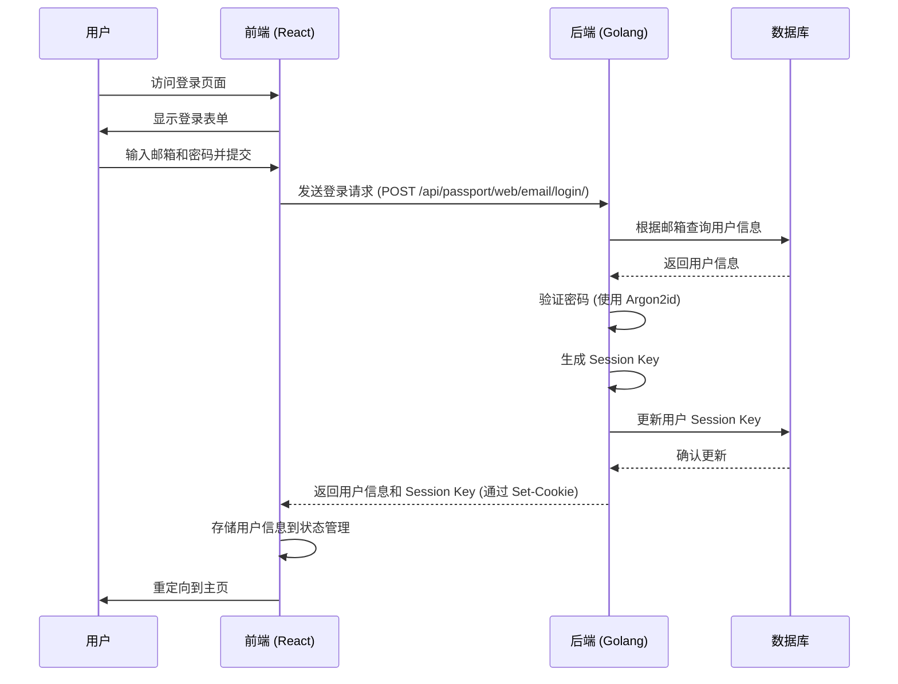

# Coze Studio 登录流程分析

## 概述

本文档详细描述了 Coze Studio 的登录流程，包括前端和后端的实现细节。登录流程是用户访问系统的第一步，确保只有经过身份验证的用户才能访问受保护的资源。

## 技术栈

- 前端：React + TypeScript
- 后端：Golang + Hertz 框架
- 认证方式：基于 Session 的认证机制
- 密码加密：Argon2id 算法

## 登录流程概览



## 前端实现

### 登录页面组件

登录页面组件位于 `frontend/packages/foundation/account-ui-adapter/src/pages/login-page/index.tsx`，主要功能包括：

1. 提供邮箱和密码输入表单
2. 表单验证（邮箱格式、必填项等）
3. 调用登录服务进行身份验证

```typescript
export const LoginPage: FC = () => {
  const [email, setEmail] = useState('');
  const [password, setPassword] = useState('');
  const [hasError, setHasError] = useState(false);

  const { login, register, loginLoading, registerLoading } = useLoginService({
    email,
    password,
  });

  // 表单验证和提交逻辑
  // ...
}
```

### 登录服务

登录服务位于 `frontend/packages/foundation/account-ui-adapter/src/pages/login-page/service.ts`，负责与后端 API 通信：

```typescript
const loginService = useRequest(
  async () => {
    const res = (await passport.PassportWebEmailLoginPost({
      email,
      password,
    })) as unknown as { data: UserInfo };
    return res.data;
  },
  {
    manual: true,
    onSuccess: setUserInfo,
  },
);
```

当登录成功后，系统会自动将用户信息存储到状态管理中，并重定向到主页：

```typescript
useEffect(() => {
  if (loginStatus === 'logined') {
    navigate('/');
  }
}, [loginStatus]);
```

## 后端实现

### API 路由

登录 API 路由定义在 `backend/api/router/coze/api.go` 中：

```go
_plugin_api.POST("/passport/web/email/login/", append(_passportwebemailloginpostMw(), coze.PassportWebEmailLoginPost)...)
```

### API 处理函数

API 处理函数位于 `backend/api/handler/coze/passport_service.go`：

```go
func PassportWebEmailLoginPost(ctx context.Context, c *app.RequestContext) {
	var err error
	var req passport.PassportWebEmailLoginPostRequest
	err = c.BindAndValidate(&req)
	if err != nil {
		c.String(http.StatusBadRequest, err.Error())
		return
	}

	resp, sessionKey, err := user.UserApplicationSVC.PassportWebEmailLoginPost(ctx, &req)
	if err != nil {
		internalServerErrorResponse(ctx, c, err)
		return
	}

	logs.Infof("[PassportWebEmailLoginPost] sessionKey: %s", sessionKey)

	c.SetCookie(entity.SessionKey,
		sessionKey,
		consts.SessionMaxAgeSecond,
		"/", domain.GetOriginHost(c),
		protocol.CookieSameSiteDefaultMode,
		false, true)
	c.JSON(http.StatusOK, resp)
}
```

### 应用层服务

应用层服务位于 `backend/application/user/user.go`：

```go
func (u *UserApplicationService) PassportWebEmailLoginPost(ctx context.Context, req *passport.PassportWebEmailLoginPostRequest) (
	resp *passport.PassportWebEmailLoginPostResponse, sessionKey string, err error,
) {
	userInfo, err := u.DomainSVC.Login(ctx, req.GetEmail(), req.GetPassword())
	if err != nil {
		return nil, "", err
	}

	return &passport.PassportWebEmailLoginPostResponse{
		Data: userDo2PassportTo(userInfo),
		Code: 0,
	}, userInfo.SessionKey, nil
}
```

### 领域层服务

领域层服务位于 `backend/domain/user/service/user_impl.go`，是登录流程的核心实现：

```go
func (u *userImpl) Login(ctx context.Context, email, password string) (user *userEntity.User, err error) {
	userModel, exist, err := u.UserRepo.GetUsersByEmail(ctx, email)
	if err != nil {
		return nil, err
	}

	if !exist {
		return nil, errorx.New(errno.ErrUserInfoInvalidateCode)
	}

	// Verify the password using the Argon2id algorithm
	valid, err := verifyPassword(password, userModel.Password)
	if err != nil {
		return nil, err
	}
	if !valid {
		return nil, errorx.New(errno.ErrUserInfoInvalidateCode)
	}

	uniqueSessionID, err := u.IDGen.GenID(ctx)
	if err != nil {
		return nil, fmt.Errorf("failed to generate session id: %w", err)
	}

	sessionKey, err := generateSessionKey(uniqueSessionID)
	if err != nil {
		return nil, err
	}

	// Update user session key
	err = u.UserRepo.UpdateSessionKey(ctx, userModel.ID, sessionKey)
	if err != nil {
		return nil, err
	}

	userModel.SessionKey = sessionKey

	resURL, err := u.IconOSS.GetObjectUrl(ctx, userModel.IconURI)
	if err != nil {
		return nil, err
	}

	return userPo2Do(userModel, resURL), nil
}
```

### 密码验证

使用 Argon2id 算法进行密码验证：

```go
// Verify that the passwords match
func verifyPassword(password, encodedHash string) (bool, error) {
	// Parse the encoded hash string
	parts := strings.Split(encodedHash, "$")
	if len(parts) != 6 {
		return false, fmt.Errorf("invalid hash format")
	}

	var p argon2Params
	_, err := fmt.Sscanf(parts[3], "m=%d,t=%d,p=%d", &p.memory, &p.iterations, &p.parallelism)
	if err != nil {
		return false, err
	}

	salt, err := base64.RawStdEncoding.DecodeString(parts[4])
	if err != nil {
		return false, err
	}
	p.saltLength = uint32(len(salt))

	decodedHash, err := base64.RawStdEncoding.DecodeString(parts[5])
	if err != nil {
		return false, err
	}
	p.keyLength = uint32(len(decodedHash))

	// Calculate the hash value using the same parameters and salt values
	computedHash := argon2.IDKey(
		[]byte(password),
		salt,
		p.iterations,
		p.memory,
		p.parallelism,
		p.keyLength,
	)

	// Compare the calculated hash value with the stored hash value
	return subtle.ConstantTimeCompare(decodedHash, computedHash) == 1, nil
}
```

### Session Key 生成

使用 HMAC-SHA256 生成安全的 Session Key：

```go
// Generate a secure session key
func generateSessionKey(sessionID int64) (string, error) {
	// Create the default session structure (without the user ID, which will be set in the Login method)
	session := Session{
		ID:        sessionID,
		CreatedAt: time.Now(),
		ExpiresAt: time.Now().Add(consts.DefaultSessionDuration),
	}

	// Serialize session data
	sessionData, err := json.Marshal(session)
	if err != nil {
		return "", err
	}

	// Calculate HMAC signatures to ensure integrity
	h := hmac.New(sha256.New, hmacSecret)
	h.Write(sessionData)
	signature := h.Sum(nil)

	// Combining session data and signatures
	finalData := append(sessionData, signature...)

	// Base64 encoding final result
	return base64.RawURLEncoding.EncodeToString(finalData), nil
}
```

## 安全特性

1. **密码加密**：使用 Argon2id 算法对密码进行加密存储，这是一种内存密集型的密码哈希函数，能有效防止彩虹表攻击和暴力破解。

2. **Session 管理**：使用 HMAC-SHA256 保证 Session Key 的完整性，防止 Session 被篡改。

3. **错误处理**：对于登录失败的情况，统一返回模糊的错误信息，防止攻击者通过错误信息判断账户是否存在。

4. **Cookie 安全**：设置安全的 Cookie 属性，如 HttpOnly、SameSite 等，防止 XSS 和 CSRF 攻击。

## 总结

Coze Studio 的登录流程从前端到后端形成了完整的闭环，通过现代化的技术栈和安全措施确保用户身份验证的安全性。整个流程包括用户输入、表单验证、API 调用、密码验证、Session 生成和状态管理等多个环节，每个环节都有相应的安全措施保护用户信息。