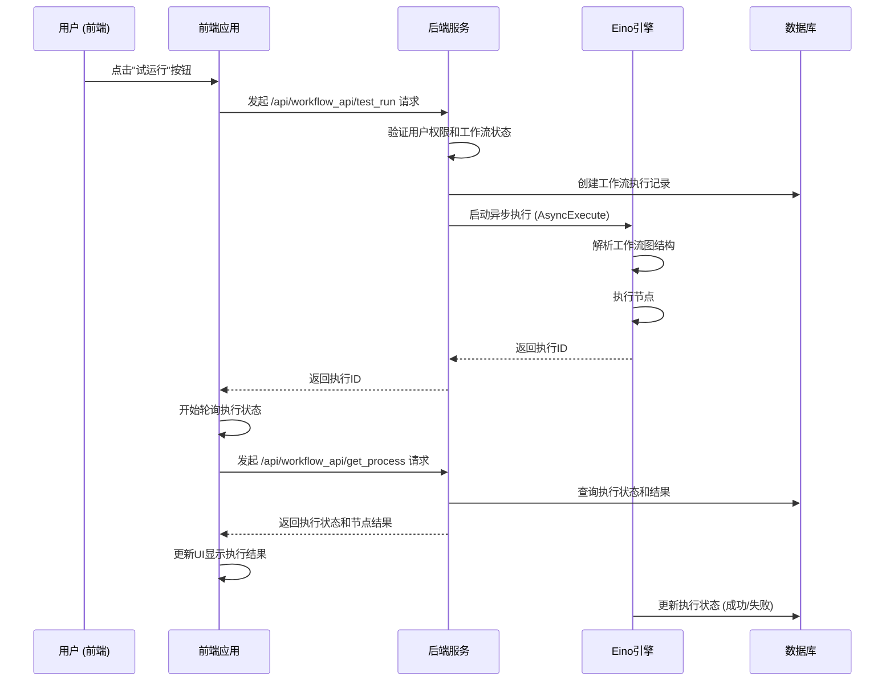

# 工作流试运行和调试分析

## 概述

本文档详细分析了 Coze Studio 中工作流的试运行和调试功能实现。该功能允许用户在开发工作流时进行测试运行，查看每个节点的执行结果，以及调试中断点。

## 技术栈

- 前端: React + TypeScript
- 后端: Golang + Hertz 框架
- 工作流引擎: Eino (基于 CloudWeGo)
- 数据库: MySQL/OceanBase
- 缓存: Redis
- 消息队列: RocketMQ

## 工作流试运行流程概览

### 时序图



## 前端实现

### 1. 试运行触发

在 `frontend/packages/workflow/playground/src/use-workflow-playground.tsx` 中，通过 `testRunFlow` 函数触发试运行：

```typescript
const testRunFlow = useCallback(async () => {
  // 验证工作流
  const hasError = await validate();
  if (hasError) {
    floatLayoutService.open('problemPanel', 'bottom');
    return;
  }
  
  // 保存工作流
  await saveService.save();
  
  // 清除之前的试运行结果
  runService.clearTestRun();
  
  // 执行试运行
  runService.testRun();
}, [validate, saveService, runService, floatLayoutService]);
```

### 2. 试运行按钮组件

在 `frontend/packages/workflow/playground/src/use-workflow-playground.tsx` 中，渲染试运行按钮：

```typescript
const testRunBtnsComp = useMemo(() => {
  if (!workflowComp) {
    return null;
  }

  return (
    <Space>
      {testRunCount > 0 ? (
        <Button
          color="highlight"
          disabled={isRunning}
          onClick={() => {
            if (testResultVisible) {
              workflowRef.current?.hideTestRunResult();
            } else {
              workflowRef.current?.showTestRunResult(
                lastTestRunResultRef.current,
              );
            }
          }}
        >
          {testResultVisible
            ? I18n.t('workflow_detail_title_lastrun_hide')
            : I18n.t('workflow_detail_title_lastrun_display')}
        </Button>
      ) : null}
      {isRunning ? (
        <Button
          color="highlight"
          onClick={() => workflowRef.current?.cancelTestRun()}
        >
          {I18n.t('workflow_detail_title_testrun_cancel')}
        </Button>
      ) : null}
      <Button
        color="highlight"
        loading={isRunning}
        onClick={() => {
          propsRef.current?.onTriggerTestRun?.();
          workflowRef.current?.triggerTestRun();
        }}
      >
        {I18n.t('workflow_detail_title_testrun')}
      </Button>
    </Space>
  );
}, [workflowComp, testRunCount, isRunning, testResultVisible]);
```

### 3. 试运行结果展示

试运行结果通过 `ExecuteResultPanel` 组件展示，位于 `frontend/packages/workflow/playground/src/components/test-run/execute-result/execute-result-panel/log-detail.tsx`：

```typescript
export const LogDetail: React.FC<{
  result: NodeResult;
  node?: FlowNodeEntity;
  scene?: LogDetailScene;
}> = ({ result, node, scene }) => {
  // 处理节点执行结果
  const { logs } = useMemo(
    () => generateLog(current, wrappedNode?.data),
    [current, wrappedNode],
  );

  return (
    <>
      {logs.map((log, idx) => (
        <LogField key={idx} log={log} scene={scene} />
      ))}
    </>
  );
};
```

## 后端实现

### 1. API 接口层

在 `backend/api/handler/coze/workflow_service.go` 中定义了试运行相关的 API 接口：

```go
// WorkFlowTestRun 试运行工作流
func WorkFlowTestRun(ctx context.Context, c *app.RequestContext) {
    var req workflow.WorkFlowTestRunRequest
    // 绑定和验证请求参数
    err := c.BindAndValidate(&req)
    if err != nil {
        invalidParamRequestResponse(c, err.Error())
        return
    }

    resp, err := appworkflow.SVC.TestRun(ctx, &req)
    if err != nil {
        internalServerErrorResponse(ctx, c, err)
        return
    }

    c.JSON(consts.StatusOK, resp)
}
```

### 2. 应用服务层

在 `backend/application/workflow/workflow.go` 中实现 `TestRun` 方法：

```go
func (w *ApplicationService) TestRun(ctx context.Context, req *workflow.WorkFlowTestRunRequest) (_ *workflow.WorkFlowTestRunResponse, err error) {
    defer func() {
        // 错误处理和panic恢复
        if panicErr := recover(); panicErr != nil {
            err = safego.NewPanicErr(panicErr, debug.Stack())
        }

        if err != nil {
            err = vo.WrapIfNeeded(errno.ErrWorkflowExecuteFail, err, errorx.KV("cause", vo.UnwrapRootErr(err).Error()))
        }
    }()

    uID := ctxutil.MustGetUIDFromCtx(ctx)

    // 验证用户空间权限
    if err := checkUserSpace(ctx, uID, mustParseInt64(req.GetSpaceID())); err != nil {
        return nil, err
    }

    // 构建执行配置
    exeCfg := workflowModel.ExecuteConfig{
        ID:           mustParseInt64(req.GetWorkflowID()),
        From:         workflowModel.FromDraft,
        Operator:     uID,
        Mode:         workflowModel.ExecuteModeDebug,
        BizType:      workflowModel.BizTypeWorkflow,
        Cancellable:  true,
    }

    // 异步执行工作流
    exeID, err := GetWorkflowDomainSVC().AsyncExecute(ctx, exeCfg, maps.ToAnyValue(req.Input))
    if err != nil {
        return nil, err
    }

    return &workflow.WorkFlowTestRunResponse{
        Data: &workflow.WorkFlowTestRunData{
            WorkflowID: req.WorkflowID,
            ExecuteID:  fmt.Sprintf("%d", exeID),
        },
    }, nil
}
```

### 3. 领域服务层

在 `backend/domain/workflow/service/executable_impl.go` 中实现 `AsyncExecute` 方法：

```go
func (w *impl) AsyncExecute(ctx context.Context, config workflowModel.ExecuteConfig, input map[string]any) (int64, error) {
    // 获取工作流基础信息和schema
    basic, schema, err := w.getWorkflowBasicAndSchema(ctx, config)
    if err != nil {
        return 0, err
    }

    // 创建执行记录
    wfExe, err := w.createExecution(ctx, config, basic, schema, "")
    if err != nil {
        return 0, err
    }

    // 启动goroutine异步执行
    safego.Go(func() {
        // 创建带超时的上下文
        runCtx, cancel := context.WithTimeout(context.Background(), consts.WorkflowRunTimeout)
        defer cancel()

        defer func() {
            if err := recover(); err != nil {
                logs.CtxErrorf(runCtx, "workflow run panic: %v, stack: %s", err, string(debug.Stack()))
                // 更新执行状态为失败
                _ = w.repo.UpdateWorkflowExecution(runCtx, &entity.WorkflowExecution{
                    ID:         wfExe.ID,
                    Status:     entity.WorkflowFailed,
                    FailReason: fmt.Sprintf("panic: %v", err),
                }, nil)
            }
        }()

        // 执行工作流
        err := w.run(runCtx, basic, schema, config, wfExe, input)
        if err != nil {
            logs.CtxErrorf(runCtx, "workflow run failed: %v", err)
        }
    })

    return wfExe.ID, nil
}
```

### 4. 工作流执行核心

在 `backend/domain/workflow/internal/compose/workflow_run.go` 中定义了 `WorkflowRunner`：

```go
type WorkflowRunner struct {
    basic     *entity.WorkflowBasic
    input     string
    resumeReq *entity.ResumeRequest
    schema    *schema2.WorkflowSchema
    sw        *schema.StreamWriter[*entity.Message]
    container *execute.StreamContainer
    config    model.ExecuteConfig

    executeID      int64
    eventChan      chan *execute.Event
    interruptEvent *entity.InterruptEvent
}

func NewWorkflowRunner(b *entity.WorkflowBasic, sc *schema2.WorkflowSchema, config model.ExecuteConfig, opts ...WorkflowRunnerOption) *WorkflowRunner {
    // 初始化运行器
    // ...
}
```

在 `backend/domain/workflow/service/executable_impl.go` 的 `run` 方法中执行工作流：

```go
func (w *impl) run(ctx context.Context, basic *entity.WorkflowBasic, schema *schema2.WorkflowSchema,
    config workflowModel.ExecuteConfig, wfExe *entity.WorkflowExecution, input map[string]any) (err error) {
    
    // 创建工作流运行器
    runner := compose.NewWorkflowRunner(basic, schema, config,
        compose.WithInput(mustMarshalToString(input)),
        compose.WithStreamWriter(w.newStreamWriter(ctx, wfExe.ID, basic.SpaceID)))

    // 运行工作流
    err = runner.Run(ctx)
    if err != nil {
        return err
    }

    return nil
}
```

### 5. 节点调试实现

节点调试通过 `WorkflowNodeDebugV2` 接口实现：

```go
// WorkflowNodeDebugV2 节点调试
func WorkflowNodeDebugV2(ctx context.Context, c *app.RequestContext) {
    var req workflow.WorkflowNodeDebugV2Request
    err := c.BindAndValidate(&req)
    if err != nil {
        invalidParamRequestResponse(c, err.Error())
        return
    }

    resp, err := appworkflow.SVC.NodeDebug(ctx, &req)
    if err != nil {
        internalServerErrorResponse(ctx, c, err)
        return
    }

    c.JSON(consts.StatusOK, resp)
}
```

在应用服务层实现节点调试逻辑：

```go
func (w *ApplicationService) NodeDebug(ctx context.Context, req *workflow.WorkflowNodeDebugV2Request) (_ *workflow.WorkflowNodeDebugV2Response, err error) {
    // 验证权限
    uID := ctxutil.MustGetUIDFromCtx(ctx)
    if err := checkUserSpace(ctx, uID, mustParseInt64(req.GetSpaceID())); err != nil {
        return nil, err
    }

    // 构建执行配置
    exeCfg := workflowModel.ExecuteConfig{
        ID:          mustParseInt64(req.GetWorkflowID()),
        From:        workflowModel.FromDraft,
        Operator:    uID,
        Mode:        workflowModel.ExecuteModeNodeDebug,
        BizType:     workflowModel.BizTypeWorkflow,
        Cancellable: true,
    }

    // 执行节点调试
    exeID, err := GetWorkflowDomainSVC().AsyncExecuteNode(ctx, req.GetNodeID(), exeCfg, req.Input)
    if err != nil {
        return nil, err
    }

    return &workflow.WorkflowNodeDebugV2Response{
        Data: &workflow.WorkFlowTestRunData{
            ExecuteID: fmt.Sprintf("%d", exeID),
        },
    }, nil
}
```

## 消息处理流程

### 1. 执行状态消息

在执行过程中，系统会发送状态消息更新执行进度：

```go
// StateMessage 表示工作流执行的状态变更
type StateMessage struct {
    ExecuteID      int64
    EventID        int64
    SpaceID        int64
    Status         WorkflowExecuteStatus
    Usage          *TokenUsage
    LastError      vo.WorkflowError
    InterruptEvent *InterruptEvent
}
```

### 2. 数据消息

执行过程中产生的数据通过 DataMessage 传递：

```go
// DataMessage 表示执行过程中的数据消息
type DataMessage struct {
    ExecuteID    int64
    Role         schema.RoleType
    Type         MessageType
    Content      string
    NodeID       string
    NodeTitle    string
    NodeType     NodeType
    Last         bool
    Usage        *TokenUsage
    FunctionCall *FunctionCallInfo
    ToolResponse *ToolResponseInfo
}
```

## 数据存储

### 1. 工作流执行记录

在 `workflow_execution` 表中存储工作流执行记录：

```go
// WorkflowExecution 工作流执行记录
type WorkflowExecution struct {
    ID              int64  `gorm:"column:id;primaryKey"`
    WorkflowID      int64  `gorm:"column:workflow_id;not null"`
    Version         string `gorm:"column:version"`
    SpaceID         int64  `gorm:"column:space_id;not null"`
    Mode            int32  `gorm:"column:mode;not null"` // 1. debug run 2. release run 3. node debug
    OperatorID      int64  `gorm:"column:operator_id;not null"`
    Status          int32  `gorm:"column:status"` // 1=running 2=success 3=fail 4=interrupted
    Duration        int64  `gorm:"column:duration"`
    Input           string `gorm:"column:input"`
    Output          string `gorm:"column:output"`
    // ...
}
```

### 2. 节点执行记录

在 `node_execution` 表中存储节点执行记录：

```go
// NodeExecution 节点执行记录
type NodeExecution struct {
    ID              int64  `gorm:"column:id;primaryKey"`
    ExecuteID       int64  `gorm:"column:execute_id;not null;index"`
    NodeID          string `gorm:"column:node_id;not null"`
    NodeName        string `gorm:"column:node_name"`
    NodeType        NodeType `gorm:"column:node_type"`
    Status          NodeExecuteStatus `gorm:"column:status"`
    Duration        int64  `gorm:"column:duration"`
    Input           string `gorm:"column:input"`
    Output          string `gorm:"column:output"`
    ErrorInfo       string `gorm:"column:error_info"`
    InputTokens     int64  `gorm:"column:input_tokens"`
    OutputTokens    int64  `gorm:"column:output_tokens"`
    // ...
}
```

## 总结

工作流试运行和调试功能通过前后端协同实现，前端负责用户交互和结果展示，后端通过 Eino 工作流引擎执行工作流并记录执行过程。该功能支持全工作流试运行和单节点调试两种模式，能够帮助用户在开发过程中验证工作流逻辑的正确性。